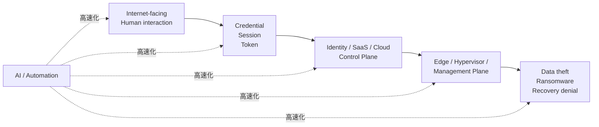
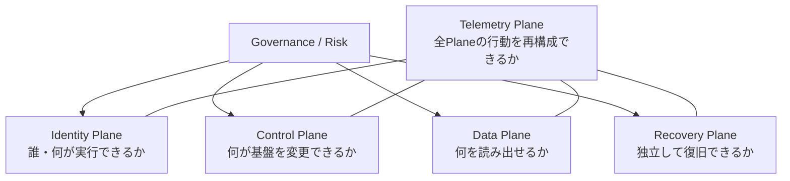

# Security Landscape 2026

> 2026年9月26日時点の主要セキュリティ年次レポートとカンファレンスを横断し、Cloud / Identity / SecOps / DevSecOps / Recovery / AIを含むEnterprise Security Architectureへ落とし込んだリファレンス。

[English](README.md)

## このリポジトリの目的

一般的な脅威レポート要約は「何が起きたか」で終わりがちです。このリポジトリでは、さらに次を扱います。

- 独立した複数ソースで繰り返される傾向は何か
- どのAttack Pathが構造的に重要になっているか
- 何をTier-0相当のSecurity Planeとして設計すべきか
- MITRE ATT&CK / NIST CSF 2.0 / CIS Controls v8.1へどう対応するか
- Azure / AWS / GCP / SaaS / CI/CD / AI Agentで何を実装すべきか
- Machine-speed attackへ対応するため、どのTelemetryとDetectionが必要か

ベンダーの優劣比較ではなく、**複数の観測結果をEnterprise Architectureへ変換すること**が目的です。

## 2026年の中心命題

2026年の変化は「AIが従来型攻撃を置き換えた」ことではありません。むしろ、**すでに有効だったAttack Pathの各段階をAIと自動化が高速・大規模化している**ことです。

横断すると特に重要なのは次の7点です。

1. **Identityが実質的なPerimeterになった。** 人間だけでなく、Service Account、OAuth Grant、Session Token、API Key、AI Agentまで攻撃面。
2. **Internet-facing / Edgeが主要入口。** VPN、Firewall、Web Asset、Network Appliance、Management Interfaceが重要。
3. **Cloud / SaaS / Supply Chainが一体化。** Trusted IntegrationやDelegated Accessが横展開経路になる。
4. **攻撃速度が圧縮されている。** 高確度イベントを人間だけで処理するSOCモデルでは間に合わないケースが増える。
5. **RecoveryはSecurity Plane。** Backupが存在することと、IdentityやHypervisorまで侵害された状態から復旧できることは別。
6. **製品数よりTelemetry Coverage。** IdP、Cloud Control Plane、SaaS、Edge、Hypervisor、Backup、CI/CD、AI Toolを横断して観測できることが重要。
7. **AI SecurityはIdentity / Authorization Engineeringへ。** モデル選定より、Agent Identity、Tool Permission、Token、Audit、Human Approval Boundaryが基礎になる。

## コンテンツ

### 年次レポート — 詳細日本語版 / English

- Mandiant M-Trends 2026 — [日本語](reports/01-m-trends-2026.ja.md) / [EN](reports/01-m-trends-2026.md)
- Verizon 2026 DBIR — [日本語](reports/02-verizon-dbir-2026.ja.md) / [EN](reports/02-verizon-dbir-2026.md)
- CrowdStrike 2026 Global Threat Report — [日本語](reports/03-crowdstrike-global-threat-report-2026.ja.md) / [EN](reports/03-crowdstrike-global-threat-report-2026.md)
- Unit 42 2026 Global Incident Response Report — [日本語](reports/04-unit42-global-ir-2026.ja.md) / [EN](reports/04-unit42-global-ir-2026.md)
- Microsoft Digital Defense Report 2025 — [日本語](reports/05-microsoft-digital-defense-report-2025.ja.md) / [EN](reports/05-microsoft-digital-defense-report-2025.md) — 2026-09-26時点の最新年次版
- IBM X-Force Threat Intelligence Index 2026 — [日本語](reports/06-ibm-xforce-2026.ja.md) / [EN](reports/06-ibm-xforce-2026.md)
- ENISA Threat Landscape 2026 — [日本語](reports/07-enisa-threat-landscape-2026.ja.md) / [EN](reports/07-enisa-threat-landscape-2026.md)
- [Report Index / Evidence Guide](reports/README.md)

### 補完レポート / Supplemental Research

- [Google Cloud Threat Horizons H1 2026](supplemental/01-google-cloud-threat-horizons-h1-2026.ja.md) — Cloud / CI/CD / Forensic Readiness
- [Sophos Active Adversary 2026](supplemental/02-sophos-active-adversary-2026.ja.md) — Identity / IR / Off-hours / Log Retention
- [Cloudflare Threat Report 2026](supplemental/03-cloudflare-threat-report-2026.ja.md) — SaaS / Token Theft / Trusted Cloud / DDoS
- [Cloudflare DDoS H1 2026](supplemental/04-cloudflare-ddos-h1-2026.ja.md) — Availability / DNS / DDoS
- [Akamai Apps/APIs/DDoS 2026](supplemental/05-akamai-app-api-ddos-2026.ja.md) — API / App / DNS / AI Coding
- [Akamai Agentic Threat Landscape 2026](supplemental/06-akamai-agentic-threat-landscape-2026.ja.md) — Agent / MCP / Browser / Nonhuman Identity
- [Check Point Cyber Security Report 2026](supplemental/07-check-point-cyber-security-report-2026.ja.md) — AI / MCP / Edge / Hybrid
- [Fortinet Global Threat Landscape 2026](supplemental/08-fortinet-global-threat-landscape-2026.ja.md) — Exploit Velocity / Network / Legitimate Tool
- [Supplemental Research一覧](supplemental/README.md)

### カンファレンス

- [RSAC 2026](conferences/01-rsac-2026.md)
- [Black Hat USA 2026](conferences/02-black-hat-usa-2026.md)
- [DEF CON 34](conferences/03-def-con-34.md)
- [FIRST CTI 2026](conferences/04-first-cti-2026.md)
- [FIRSTCON26](conferences/05-firstcon26.md)

### 横断分析・設計

- [Consensus Matrix](analysis/cross-report-trends.md)
- [Attack Paths](analysis/attack-paths.md)
- [2026 Timeline](analysis/trend-timeline.md)
- [Enterprise Architectureへの示唆](analysis/enterprise-architecture-implications.md)
- [Enterprise Architect Perspective](analysis/enterprise-architect-perspective.md)
- [Reference Architecture](architecture/reference-architecture.md)
- [Security Planes](architecture/security-planes.md)
- [Identity Architecture](architecture/identity.md)
- [Recovery Architecture](architecture/recovery.md)
- [Azure / AWS / GCP Control Mapping](architecture/cloud-controls.md)
- [Telemetry Architecture](architecture/telemetry.md)

### Framework / AI / Operations

- [MITRE ATT&CK](frameworks/mitre-attack.md)
- [NIST CSF 2.0](frameworks/nist-csf.md)
- [CIS Controls v8.1](frameworks/cis-controls.md)
- [NIST × CIS × 2026 Threat Crosswalk](frameworks/nist-cis-crosswalk.md)
- [AI Security Architecture](ai-security/README.md)
- [AI Agent Security](ai-security/agent-security.md)
- [MCP Security](ai-security/mcp-security.md)
- [Detection Engineering](operations/detection-engineering.md)
- [2026 Security Priorities](operations/security-priorities.md)

## 設計モデル

2026年を一言で表すなら、

> **Endpoint Securityの延長として考えるのではなく、Identity、Cloud/SaaS Control Plane、Edge/Virtualization、Recovery、Privileged AI Agentを独立したSecurity Boundaryとして再設計する。**

ということです。

## Evidenceの扱い

- **Major** — レポートの主要テーマ・主要発見
- **Observed** — 明確な観測はあるが中心テーマではない
- **Not emphasized** — 今回確認した範囲では主要論点ではない

各ベンダーの母集団・地域・Incident Definitionが異なるため、統計値そのものをベンダー間ランキングには使いません。

詳細は [SOURCES.md](SOURCES.md)、年次レポートの言語別一覧は [reports/README.md](reports/README.md)、更新方法は [CONTRIBUTING.md](CONTRIBUTING.md) を参照してください。

## 次にアップデートする時期

このRepositoryは、**定期更新より「重要な変化があった時に更新する」ことを優先**します。

### 次回のおすすめ確認時期：2026年10月末〜11月

以下のいずれかが発生したら、部分更新するのがよいです。

- Microsoftが次のDigital Defense Report年次版を公開した
- 主要Vendorが2026年版Threat / Incident Response Reportを大きく更新した
- Black Hat / DEF CON / FIRSTなどの追加公開資料で、現在のArchitecture結論を変える重要な研究が出た
- MITRE ATT&CK / NIST CSF / CIS Controls / MCP / Cloud ProviderのSecurity Guidanceに、現在のMappingへ影響する変更が入った

大きなTriggerがなければ、**2026年12月〜2027年1月**に年末レビューを行い、2026年版を一度締めるのがおすすめです。

### 次の大規模更新：2027年2月〜5月

2027年版の主要Annual Reportが出始めた段階で、本格的な更新を行います。

その際は、

1. 2027 Editionを追加する
2. 2026 Editionは履歴として残す
3. **2026 → 2027で何が変わったか**を新しく分析する
4. Consensus MatrixとArchitecture ImplicationをEvidenceが変わった部分だけ更新する
5. 現在のSecurity Plane Modelが引き続き有効か再評価する

という進め方にします。

## 次にやるとよいこと

優先順位は次の通りです。

1. **2026年末の総括を追加する**  
   年末に、
   - さらに強まったTrend
   - 年初から変わらなかったTrend
   - 話題ほどEnterprise Architectureへ影響しなかったTrend  
   を分けて整理します。

2. **2026 → 2027 Delta Analysisを作る**  
   毎年全文を書き直すのではなく、
   - Initial Access
   - Identity Abuse
   - Cloud / SaaS
   - Edge / Virtualization
   - Ransomware / Recovery Denial
   - AI Attack / AI Defense
   - Attack / Response Speed  
   が前年からどう変化したかを追えるようにします。

3. **Conference資料も日本語版を追加する**  
   RSAC / Black Hat / DEF CON / FIRST CTI / FIRSTCONについても、`reports/` と同じ英語・日本語のペア構成にすると、Repository全体の一貫性が上がります。

4. **Source Update Monitoring — 実装済み**  
   月1回、主要な公式Landing Pageを確認し、新EditionのMarkerを検知したらGitHub Issueを自動作成する [Security Source Monitor](monitor/README.md) を追加しました。今後はFrameworkやCloud Security GuidanceもRegistryへ必要に応じて追加します。

5. **CHANGELOG / Release Tagを導入する**  
   まとまった更新ごとに、
   - `2026-09-snapshot`
   - `2026-year-end`
   - `2027-q1-refresh`  
   のようなTag / Releaseを作ると、どの時点の知見か追いやすくなります。

6. **Architectureは流行ではなくEvidenceで変える**  
   新しいKeywordが流行したから新しいSecurity Domainを増やすのではなく、複数の独立したSourceや重要な技術変化が裏付けた時だけArchitectureを変更します。

## 更新時チェックリスト

更新するときは次を確認します。

- [ ] Core 7レポートに新版が出ていないか確認
- [ ] Supplemental ReportのSource Monitor結果を確認
- [ ] Conferenceの追加公開資料・研究を確認
- [ ] 重要統計とObservation Periodを再確認
- [ ] 英語版と日本語版を同時に更新
- [ ] [SOURCES.md](SOURCES.md) を更新
- [ ] Cross-report Consensus Matrixを再評価
- [ ] MITRE ATT&CK / NIST / CIS Mappingを確認
- [ ] Azure / AWS / GCPの実装Referenceを確認
- [ ] AI Agent / MCP Security Guidanceを確認
- [ ] Link Check CIを実行
- [ ] CHANGELOG / Release Noteへ変更内容を記録

更新頻度を増やすこと自体が目的ではありません。

> **「2026年9月時点のまとめ」を保存しつつ、重要な変化だけを継続的に取り込み、Living Architecture Referenceとして育てること**

をMaintenance方針にします。
