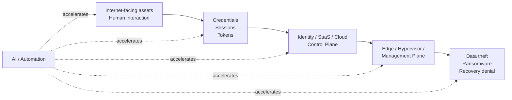
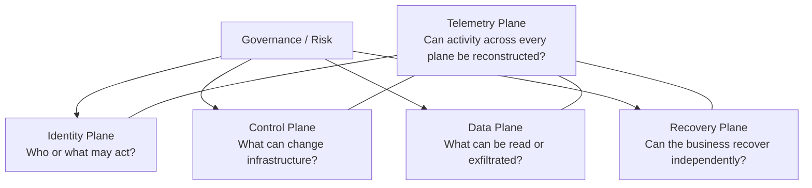

# Security Landscape 2026

> A 2026-09-26 snapshot of major cybersecurity reports and conferences, translated into an Enterprise Security Architecture reference for Cloud, Identity, SecOps, DevSecOps, Recovery, and AI systems.

[日本語版](README.ja.md)

## Why this repository exists

Most annual threat reports answer **what happened**. This repository also asks:

- Which findings are repeated across independent data sets?
- Which attack paths are becoming structurally important?
- Which security planes should architects treat as Tier 0?
- How do the findings map to MITRE ATT&CK, NIST CSF 2.0, and CIS Controls v8.1?
- What should change in Azure, AWS, GCP, SaaS, CI/CD, and AI-agent environments?
- Which telemetry and detection capabilities are required to respond at machine speed?

The result is not a vendor ranking. It is a cross-source architecture synthesis.\n\n### Architecture lens\n\nThe repository intentionally uses a **generalist architect lens across Enterprise IT × Cloud × Security × DevSecOps × Operations**. Threat intelligence is translated into trust boundaries, identity design, control-plane guardrails, telemetry, recovery, and operating-model decisions.

## 2026 thesis

The central 2026 shift is not that AI replaced traditional intrusion methods. Instead, **AI and automation are reducing friction across already-effective attack paths**.

Seven themes recur across the 2026 evidence base:

1. **Identity is the practical perimeter.** Human and non-human identities, OAuth grants, session tokens, API keys, service accounts, and agents are all part of the attack surface.
2. **Internet-facing and edge infrastructure is a high-value entry point.** VPNs, firewalls, web assets, network appliances, and exposed management interfaces remain critical.
3. **Cloud, SaaS, and supply chain are converging.** Trusted integrations and delegated access can become lateral-movement paths.
4. **Attack speed is compressing.** Human-only triage and response models are increasingly too slow for high-confidence events.
5. **Recovery is a security plane.** Backup existence is not equivalent to recoverability when identity, hypervisor, and recovery infrastructure are compromised together.
6. **Telemetry blind spots matter more than product count.** IdP, cloud control plane, SaaS, edge, hypervisor, backup, CI/CD, and AI-tool activity need to be observable.
7. **AI security is becoming identity and authorization engineering.** Agent identity, tool permissions, token handling, auditability, and human approval boundaries are more fundamental than model choice alone.

## Repository map

### Evidence

- [Mandiant M-Trends 2026](reports/01-m-trends-2026.md)
- [Verizon 2026 DBIR](reports/02-verizon-dbir-2026.md)
- [CrowdStrike 2026 Global Threat Report](reports/03-crowdstrike-global-threat-report-2026.md)
- [Unit 42 2026 Global Incident Response Report](reports/04-unit42-global-ir-2026.md)
- [Microsoft Digital Defense Report 2025](reports/05-microsoft-digital-defense-report-2025.md) — latest annual edition available as of 2026-09-26
- [IBM X-Force Threat Intelligence Index 2026](reports/06-ibm-xforce-2026.md)
- [ENISA Threat Landscape 2026](reports/07-enisa-threat-landscape-2026.md)

### Conferences

- [RSAC 2026](conferences/01-rsac-2026.md)
- [Black Hat USA 2026](conferences/02-black-hat-usa-2026.md)
- [DEF CON 34](conferences/03-def-con-34.md)
- [FIRST CTI 2026](conferences/04-first-cti-2026.md)
- [FIRSTCON26](conferences/05-firstcon26.md)

### Cross-source analysis

- [Consensus matrix](analysis/cross-report-trends.md)
- [Attack paths](analysis/attack-paths.md)
- [2026 timeline](analysis/trend-timeline.md)
- [Enterprise architecture implications](analysis/enterprise-architecture-implications.md)
- [Enterprise architect perspective](analysis/enterprise-architect-perspective.md)

### Architecture

- [Reference architecture](architecture/reference-architecture.md)
- [Security planes](architecture/security-planes.md)
- [Identity architecture](architecture/identity.md)
- [Recovery architecture](architecture/recovery.md)
- [Azure / AWS / GCP control mapping](architecture/cloud-controls.md)
- [Telemetry architecture](architecture/telemetry.md)

### Framework crosswalks

- [MITRE ATT&CK](frameworks/mitre-attack.md)
- [NIST CSF 2.0](frameworks/nist-csf.md)
- [CIS Controls v8.1](frameworks/cis-controls.md)
- [NIST CSF 2.0 × CIS Controls v8.1 × 2026 Threat Crosswalk](frameworks/nist-cis-crosswalk.md)

### AI security

- [Agent security](ai-security/agent-security.md)
- [MCP security](ai-security/mcp-security.md)

### Operations

- [Detection engineering](operations/detection-engineering.md)
- [2026 security priorities](operations/security-priorities.md)

## Architecture model

The practical architecture takeaway is:

> **Treat identity, cloud/SaaS control planes, edge/virtualization management, recovery, and privileged AI-agent orchestration as first-class security boundaries—not as extensions of endpoint security.**

## Evidence model

The cross-report matrix uses explicit evidence labels rather than subjective scores:

- **Major** — a primary theme or prominent finding in the source.
- **Observed** — supported by the source but not a dominant theme.
- **Not emphasized** — not a meaningful focus in the reviewed material.

Vendor statistics are not ranked against one another because each report uses a different observation population, methodology, geography, and incident definition.

## Scope and methodology

- Snapshot date: **2026-09-26 JST**
- Primary and official sources are preferred.
- Important statistics are paired with their source and observation period inside each report note.
- Cross-source conclusions require repeated evidence or an explicit analytical rationale.
- Conference notes summarize official programs, recaps, and representative technical sessions; they are not verbatim coverage of every talk.
- Framework mappings are architectural crosswalks, not claims that the source reports themselves used those frameworks.
- See [SOURCES.md](SOURCES.md) for the source register and [reports/_template.md](reports/_template.md) for the update schema.

## Maintenance

This is intended to remain reproducible rather than become a one-off summary. See [CONTRIBUTING.md](CONTRIBUTING.md) for the update workflow.