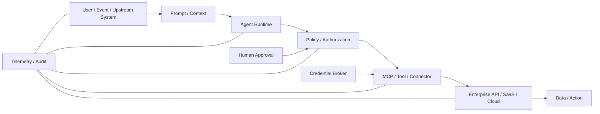

# AI Security Architecture

The 2026 threat landscape makes AI security a normal **enterprise identity, authorization, integration, telemetry, and incident-response problem**.

The core architectural idea is:

> **An AI agent is a non-human identity that can reason and act through delegated authority.**

The model is important, but the security boundary is the combination of **identity + context + tools + credentials + downstream authority**.

## Architecture model



## Four principles

```text
Reasoning ≠ Authorization
Model decision ≠ Security decision
Tool availability ≠ Permission
Delegation ≠ Unlimited authority
```

A prompt injection or model error becomes a serious security incident only when the system gives the model enough reachable authority to cause impact.

## Security objectives

| Objective | Design requirement | Evidence |
|---|---|---|
| Identity | Every production agent has a unique logical identity, owner, environment, purpose, and revocation path | Agent registry / IAM inventory |
| Delegation | User authority and agent/workload authority remain distinguishable | Token claims / audit principal / delegation chain |
| Credential lifetime | Prefer short-lived, audience-bound credentials and federation | Token TTL / static-secret inventory |
| Tool authority | Explicit allowlist; separate read/write/admin capabilities | Tool registry / policy |
| Data boundary | Data classification controls what can enter context and what can leave | DLP / policy decision / data-access log |
| Human approval | Irreversible, destructive, privileged, or externally consequential actions cross an approval boundary | Approval audit |
| Blast radius | Rate, scope, tenant, environment, and transaction limits constrain mistakes | Policy / quota / sandbox |
| Auditability | Every action is attributable to user/trigger, agent, tool, delegated identity, target, decision, and result | Correlated event trail |
| Revocation | Agent, connector, token, tool, or downstream authority can be cut independently | Tested kill-switch / revoke runbook |
| Recovery | AI automation cannot destroy the only recovery path | Recovery-plane policy |

## Trust boundaries

### 1. User / upstream trigger

Threats:

- spoofed caller;
- compromised upstream system;
- over-broad delegated user consent;
- automation running outside intended business context.

Controls:

- authenticate the triggering principal;
- bind requests to tenant/environment/purpose;
- make delegation explicit;
- separate interactive user actions from unattended service actions.

### 2. Prompt / context

Treat retrieved content as **untrusted data**, even when it came from an internal document, ticket, email, repository, website, or tool result.

Controls:

- keep security policy outside untrusted context;
- label data source and trust level;
- minimize sensitive context;
- prohibit content from directly granting authority;
- require authorization again at the tool boundary.

### 3. Agent runtime

Controls:

- unique agent identity;
- isolated runtime where appropriate;
- approved model/runtime versions;
- bounded memory/state;
- egress restrictions;
- rate / recursion / cost limits;
- kill switch.

### 4. Tool / MCP / connector

This is usually the **highest-value boundary**.

Ask:

- Can it read, write, delete, publish, deploy, send, or execute?
- Can it create or refresh credentials?
- Can it change IAM?
- Can it call another agent?
- Can it cross tenants/accounts/environments?
- Can tool output introduce further untrusted instructions?

See [MCP Security](mcp-security.md).

### 5. Downstream identity and API

Prefer:

```text
Agent
→ policy decision
→ credential broker / federation
→ short-lived resource-specific authority
→ downstream API
```

Avoid:

```text
Agent config / prompt / local file
→ reusable admin API key
→ broad downstream authority
```

## Human approval model

Human approval should be **risk-proportional**, not inserted into every tool call.

| Action class | Default |
|---|---|
| Read low-sensitivity metadata | Autonomous within policy |
| Read sensitive data | Policy/data-classification dependent |
| Reversible scoped write | Autonomous only inside bounded policy |
| External communication | Approval depending on audience and impact |
| Production deployment | Controlled deployment gate |
| IAM / privilege change | Human approval |
| Credential creation / trust change | Human approval |
| Delete / destructive / irreversible action | Human approval or dual control |
| Recovery-plane destructive action | Strong approval / separation of duties |

## Telemetry schema

At minimum, correlate:

```text
correlation_id
timestamp
trigger_principal
agent_id
agent_version
session/run_id
model/runtime
tool_or_server
tool_action
target_resource
delegated_principal
authorization_scope
policy_decision
approval_state
result
error
```

Sensitive prompts, tool arguments, and outputs may contain credentials or regulated data. Logging must itself follow classification, redaction, access-control, and retention policy.

## Detection ideas

- New agent or connector appears without an owner.
- Agent starts using a never-before-seen tool.
- Tool call targets a new tenant, account, region, or environment.
- Destructive/write action occurs without expected approval state.
- Token is reused by a different runtime or agent.
- Agent requests broader scopes than its baseline.
- Agent creates/refreshes credentials unexpectedly.
- Local MCP server spawns an unexpected shell/child process.
- Connector begins contacting an unapproved external domain.
- Agent crosses a declared data-classification boundary.
- Tool-call rate, recursion depth, or cost deviates sharply from baseline.

## Incident response

For a suspected agent or connector compromise:

1. Stop the agent/run.
2. Disable the connector/MCP server if needed.
3. Revoke delegated tokens, sessions, and client credentials.
4. Identify every downstream resource reachable through that authority.
5. Reconstruct actions using correlation IDs and downstream audit logs.
6. Rotate reusable secrets if exposure cannot be excluded.
7. Remove unauthorized changes or created credentials.
8. Re-enable only after scope, tool policy, trust conditions, and approval boundaries are corrected.

## Maturity path

### Level 1 — Inventory

- approved AI services;
- agents;
- connectors;
- MCP servers;
- owners;
- data classes.

### Level 2 — Identity and authorization

- unique agent identities;
- short-lived credentials;
- tool allowlists;
- delegated scopes;
- approval boundaries.

### Level 3 — Telemetry and detection

- correlated tool/API audit;
- anomaly detection;
- policy-decision logging;
- central SIEM integration.

### Level 4 — Bounded automation and response

- reversible automated containment;
- rapid token/connector revocation;
- red-team scenarios;
- tested incident playbooks;
- recovery-plane protection.

## Repository documents

- [AI Agent Security](agent-security.md) — agent identity, delegated authority, approvals, and threat model.
- [MCP Security](mcp-security.md) — MCP authorization, token handling, server trust, local-server risk, and incident response.
- [Enterprise Reference Architecture](../architecture/reference-architecture.md) — places AI-agent orchestration in the broader Identity and Control Planes.
- [Telemetry Architecture](../architecture/telemetry.md) — cross-plane detection design.
- [NIST/CIS Crosswalk](../frameworks/nist-cis-crosswalk.md) — governance and control mapping.

## Standards status

This repository separates **normative MCP specification requirements** from roadmap/proposal work.

- MCP protocol revision **2026-07-28** is final.
- Its authorization hardening includes issuer validation and credential-isolation/scope behavior implemented through final SEPs.
- The August 2026 MCP roadmap explicitly calls out **agent identity and enterprise-ready security** as continuing work.
- Proposal/draft SEPs are treated as directional research, not as current protocol requirements.

Primary references:

- https://modelcontextprotocol.io/specification/2026-07-28/basic/authorization
- https://blog.modelcontextprotocol.io/posts/mcp-roadmap/
- https://plan.modelcontextprotocol.io/conformance
- https://plan.modelcontextprotocol.io/seps
