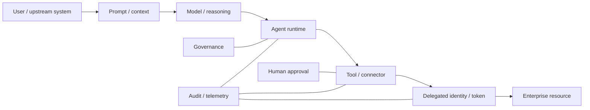

# AI Agent security

The 2026 threat landscape makes a useful distinction:

> The primary enterprise risk of an agent is not that it can reason. It is that it can **act with delegated authority**.

Treat an AI agent as a privileged software identity with a reasoning component.

## Agent security model



## Security boundaries

### 1. Agent identity

Every production agent should have:

- unique logical identity;
- owner;
- environment;
- business purpose;
- allowed tool set;
- data classification;
- maximum privilege;
- revocation mechanism.

Avoid a shared "AI service account" for unrelated agents.

### 2. Tool authority

Tool access is the real permission boundary.

Ask:

- Can the tool read or write?
- Can it send messages?
- Can it execute code?
- Can it create credentials?
- Can it modify IAM?
- Can it delete or publish?
- Can it call another agent or external service?

Use allowlists and separate read from write authority where possible.

### 3. Delegated identity

Prefer:

- user-delegated, scoped access when acting for a user;
- workload federation for service actions;
- short-lived credentials;
- audience-bound tokens;
- minimum scopes.

Avoid embedding reusable cloud/API secrets in prompts, configuration, or local agent files.

### 4. Human approval boundary

Not every tool call needs approval.

A useful tiering model:

| Action | Default |
|---|---|
| Read low-sensitivity metadata | Agent may execute |
| Read sensitive business data | Policy/context dependent |
| Reversible write | Agent may execute within bounded scope |
| External communication | Review depending on audience/impact |
| Privilege/IAM change | Human approval |
| Credential creation | Human approval |
| Destructive / irreversible action | Human approval |
| High-impact production deployment | Human approval or controlled deployment gate |

The goal is **risk-proportional friction**.

### 5. Auditability

Capture:

- user/upstream request;
- agent identity;
- model/session identifier;
- selected tool;
- normalized arguments;
- delegated principal;
- authorization scopes;
- target resource;
- result;
- approval state;
- correlation ID.

Do not log secrets or unrestricted prompt contents without classification controls.

## Threat model

### Prompt injection / poisoned context

A document, website, ticket, email, repository, or tool result may contain instructions designed to influence the agent.

Mitigation:

- treat retrieved content as untrusted data;
- separate system/tool policy from content;
- use tool-level authorization independent of model output;
- require human approval for high-impact actions;
- restrict outbound destinations.

### Excessive agency

A model error becomes an incident when authority is too broad.

Mitigation:

- narrow tools;
- narrow scopes;
- short credentials;
- transactional/reversible actions;
- rate and blast-radius limits.

### Credential leakage

Mitigation:

- never expose reusable secrets to the model where avoidable;
- use token brokers/federation;
- redact tool results;
- protect logs;
- rotate/revoke rapidly.

### Cross-agent delegation

Mitigation:

- explicit delegation chain;
- downstream agent identity;
- no implicit inheritance of all upstream authority;
- policy evaluation at every trust boundary.

## Architecture principle

```text
Reasoning ≠ Authorization
Model decision ≠ Security decision
Tool availability ≠ Permission
Delegation ≠ Unlimited authority
```

## Detection ideas

- Agent invokes a tool never used by that agent before.
- Write/destructive action without expected approval state.
- Token used by a different agent/runtime.
- Agent accesses a data class outside its declared purpose.
- Unusual volume of tool calls.
- New connector added to a high-privilege agent.
- Tool call targets a new tenant/account/environment.
- Agent creates or refreshes a credential unexpectedly.

## Relationship to 2026 reporting

M-Trends, CrowdStrike, Unit 42, Microsoft, IBM, and conference programs all show AI being used as an accelerator or becoming an attack surface. The architectural response is to integrate agents into normal identity, authorization, telemetry, and incident-response systems rather than create a separate "AI exception zone."

See [MCP Security](mcp-security.md).