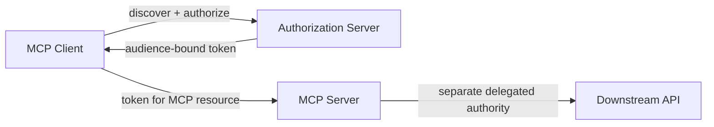

# Model Context Protocol (MCP) security

Reviewed against the **2026-07-28 MCP Authorization specification and Security Best Practices**.

Primary references:

- https://modelcontextprotocol.io/specification/2026-07-28/basic/authorization
- https://modelcontextprotocol.io/docs/tutorials/security/security_best_practices

## Core principle

An MCP server is not "just a plugin."

It can become a security boundary that joins:

```text
LLM / Agent
↔ MCP Client
↔ MCP Server
↔ OAuth / Credential
↔ Enterprise API / Data / Action
```

Treat every server as a piece of privileged integration software.

## Authorization requirements that matter architecturally

The 2026-07-28 MCP specification defines HTTP authorization around OAuth 2.1-oriented mechanisms.

Important properties include:

- protected-resource metadata and authorization-server discovery;
- token audience binding and validation;
- secure token storage;
- short-lived access tokens;
- secure communication;
- authorization-code protections;
- redirect validation;
- scope selection.

The specification and security guidance explicitly reject unsafe token handling patterns such as forwarding tokens to unintended resources.

## Threats and controls

### Confused deputy

Risk:

An MCP server acts on a state handle, resource, or downstream authority without proving it belongs to the authenticated caller.

Control:

- verify every inbound request;
- bind state server-side to the authenticated principal;
- use unpredictable/expiring handles;
- never treat possession of a handle as authentication.

### Token theft

Risk:

A token copied from logs, memory, local storage, or a compromised runtime is replayed.

Control:

- short-lived tokens;
- secure storage;
- refresh-token rotation where applicable;
- no secrets in URLs;
- protect logs and crash dumps;
- audience binding.

### Token passthrough / audience confusion

Risk:

A server accepts or forwards a token that was issued for a different resource.

Control:

- validate token audience;
- request resource-specific tokens;
- do not transit unrelated tokens;
- separate downstream authorization from MCP client authorization.

### Over-broad scopes

Risk:

A compromised token grants `files:*`, `db:*`, `admin:*`, or equivalent broad authority.

Control:

- minimum scopes;
- incremental authorization where practical;
- separate read/write/admin scopes;
- use resource- or tenant-specific restrictions.

### Local MCP server compromise

The MCP security guidance explicitly treats local servers as a risk because they can have direct system access.

Controls include:

- process isolation/sandboxing;
- least-privilege file/system permissions;
- safe URL handling;
- avoid shell execution for opening URLs;
- logging local stdio server usage;
- extra authorization for dangerous commands.

### Malicious / replaced server

Enterprise controls should additionally include:

- approved server registry;
- publisher/source verification;
- pinned package/version where practical;
- signed release/provenance;
- code review for privileged servers;
- egress restrictions;
- explicit owner and data classification;
- emergency disable/revoke mechanism.

## Enterprise MCP registry

Recommended metadata:

| Field | Example |
|---|---|
| Server | `github-enterprise-mcp` |
| Owner | Platform Security |
| Source | Approved repository/package |
| Version | Pinned |
| Transport | HTTP / stdio |
| Data class | Internal / Confidential |
| Tools | repo.read, issue.write |
| Identity | Workload / delegated user |
| OAuth scopes | Explicit list |
| Egress | github.example.com only |
| Approval | Writes require policy/human gate |
| Logs | Central telemetry |
| Review date | Quarterly |

## MCP trust flow



The key design rule is that the token presented to the MCP server should not automatically become a universal downstream bearer credential.

## Detection ideas

- New/unapproved MCP server registration.
- New broad scope requested by an existing server.
- Token audience mismatch.
- Same token used from multiple clients/runtimes.
- Local MCP server spawning shell or unexpected child process.
- MCP server accessing a new external domain.
- Write/delete tool invoked outside expected approval flow.
- Tool invocation volume significantly outside baseline.

## Incident response

For a compromised MCP integration:

1. Disable the server/connector.
2. Revoke its tokens and client credentials.
3. Identify downstream systems reachable through the server.
4. Search tool/audit logs for actions by the delegated principal.
5. Rotate reusable secrets if any were exposed.
6. Review approvals/scopes and remove excess authority before re-enabling.
