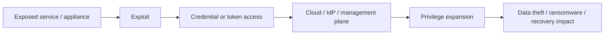
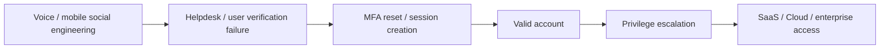
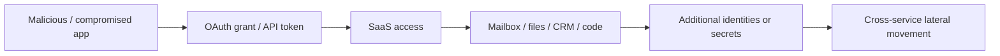
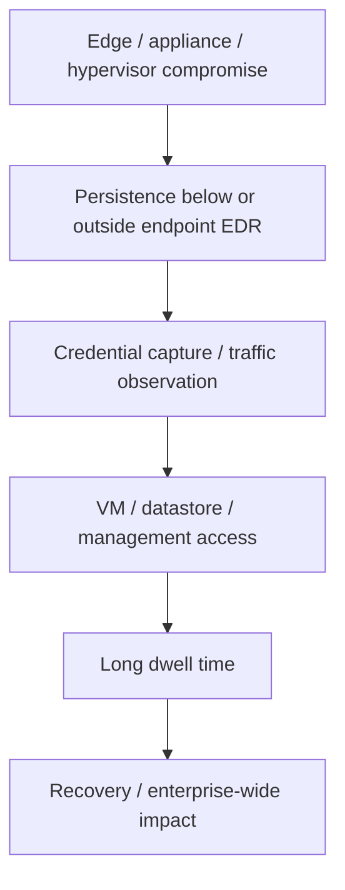
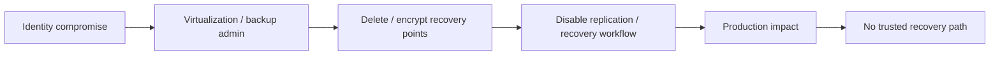
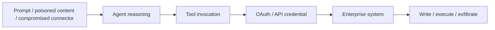

# 2026 attack paths

This document converts the report-level findings into reusable attack-path models. ATT&CK IDs are analytical mappings by this repository, not publisher-supplied mappings unless explicitly stated.

## Path 1 — Internet-facing exploit to control plane

### Relevant ATT&CK

- **T1190 — Exploit Public-Facing Application**
- **T1078 — Valid Accounts**
- **T1098 — Account Manipulation**
- **T1528 — Steal Application Access Token**

### Why it matters in 2026

DBIR, M-Trends, IBM, CrowdStrike, and Unit 42 all reinforce the importance of exposed systems or vulnerability exploitation. The architectural risk is not only the vulnerable host; it is the reachable identity and management plane behind it.

### Required controls

- External attack-surface inventory.
- Exploit-informed prioritization rather than CVSS-only queues.
- Segmentation between internet-facing workloads and Tier-0 management.
- Short-lived workload credentials.
- Centralized audit logs for edge and management devices.

---

## Path 2 — Vishing / helpdesk abuse to identity takeover

### Relevant ATT&CK

- **T1078 — Valid Accounts**
- **T1550.004 — Web Session Cookie**
- **T1098 — Account Manipulation**

### Architecture response

- Phishing-resistant MFA.
- High-assurance helpdesk recovery workflow.
- Separate verification path for privileged users.
- Session/token anomaly detection.
- Just-in-time privileged access.

---

## Path 3 — OAuth / API token to SaaS lateral movement

### Relevant ATT&CK

- **T1528 — Steal Application Access Token**
- **T1550.001 — Application Access Token**
- **T1078.004 — Cloud Accounts**

### Architecture response

- Restrict end-user app consent.
- Inventory OAuth grants, API keys, integrations, and owners.
- Require granular scopes and short-lived credentials.
- Establish emergency integration-revocation runbooks.
- Correlate token use with source network, device, workload, and expected application behavior.

---

## Path 4 — Edge / hypervisor persistence

### Relevant ATT&CK

ATT&CK increasingly covers network devices, ESXi, IaaS, identity providers, and SaaS in techniques such as **T1098** and **T1078**. The key lesson is that telemetry should follow the attack surface, not only agent-capable operating systems.

### Architecture response

- Treat hypervisor, network-security management, and backup control planes as Tier 0.
- Use dedicated admin paths and separate credentials.
- Export admin, authentication, and configuration-change logs.
- Threat hunt for persistence where endpoint agents cannot operate.

---

## Path 5 — Recovery denial

### Architecture response

- Separate recovery identity boundary.
- Immutable or offline recovery points.
- Separate admin credentials and management path.
- Restore exercises that assume IdP and hypervisor loss.
- Record recovery-plane changes in a security telemetry pipeline.

---

## Path 6 — Agentic AI as privileged software identity

The important boundary is between **reasoning** and **authority**.

See [Agent Security](../ai-security/agent-security.md) and [MCP Security](../ai-security/mcp-security.md).