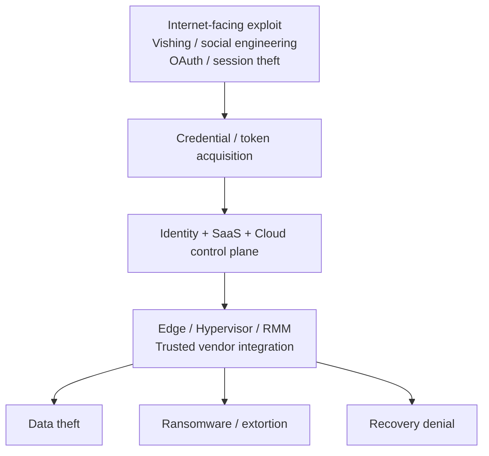

# Cross-report consensus matrix

This matrix records **evidence prominence**, not a vendor score.

- **Major** — a primary theme or prominent finding.
- **Observed** — explicitly supported, but not a dominant theme.
- **Not emphasized** — not materially emphasized in the reviewed material.

Because each publisher uses a different observation population and methodology, percentages are intentionally not compared as if they shared a denominator.

## 2026 consensus map

| Theme | M-Trends | DBIR | CrowdStrike | Unit 42 | Microsoft | IBM | ENISA | Conference signal |
|---|---|---|---|---|---|---|---|---|
| AI accelerates offensive activity | Major | Major | Major | Major | Major | Major | Observed | RSAC / Black Hat / DEF CON / FIRST |
| Identity / credential / token abuse | Major | Major | Major | Major | Major | Major | Observed | RSAC / Black Hat / FIRST |
| Vulnerability / exposed-asset exploitation | Major | Major | Major | Major | Major | Major | Major | Black Hat / DEF CON |
| Edge / network appliance | Major | Observed | Major | Major | Observed | Observed | Observed | DEF CON |
| Cloud / SaaS | Major | Major | Major | Major | Major | Major | Observed | RSAC / Cloud Village / FIRST |
| Supply chain / trusted connectivity | Major | Major | Observed | Major | Major | Observed | Major | RSAC / Black Hat / FIRST |
| Ransomware / extortion | Major | Major | Major | Major | Major | Major | Major | FIRST / DEF CON |
| Recovery / resilience | Major | Major | Major | Major | Major | Major | Major | RSAC / FIRST |
| Machine-speed response pressure | Major | Observed | Major | Major | Major | Major | Observed | Black Hat / FIRST |
| Long-term / non-EDR telemetry | Major | Observed | Major | Major | Major | Observed | Observed | FIRST / DEF CON |

## Evidence anchors

The following examples explain why the matrix looks the way it does.

| Source | Evidence anchor |
|---|---|
| M-Trends 2026 | 500k+ hours of 2025 investigations; exploit remained the leading initial infection vector; voice phishing rose; edge persistence and long dwell time are emphasized; median handoff from initial access to a secondary threat group reached 22 seconds. |
| Verizon DBIR 2026 | 31% of breaches began with software vulnerabilities; 48% involved ransomware; generative AI augmented 15% of attack techniques; mobile social engineering showed higher click rates. |
| CrowdStrike 2026 | 27-second fastest eCrime breakout; AI-enabled adversary activity +89%; cloud-conscious state-nexus intrusions +266%; 40% of vulnerabilities exploited by China-nexus actors targeted edge devices. |
| Unit 42 2026 | Identity weaknesses materially contributed to almost 90% of investigations; attack lifecycle compression, browser activity, SaaS, trusted connectivity, and multi-surface attacks are core themes. |
| Microsoft MDDR 2025 | AI-driven phishing, destructive cloud campaigns, hybrid ransomware, identity and cloud resilience, and automated response are prominent themes. |
| IBM X-Force 2026 | Public-facing exploitation +44% YoY; 56% of disclosed vulnerabilities did not require authentication; 300k AI-chatbot credentials observed for sale; active ransomware groups +49%. |
| ENISA 2026 | Ransomware remained the most impactful short-term incident type; geopolitical DDoS activity and NIS2-essential entities feature heavily; AI use in malicious operations is expected to grow. |

See the individual [report notes](../reports/) for observation periods and source links.

## Cross-source synthesis

The shared attack path can be summarized as:



AI does not replace this path. It lowers the cost and time of reconnaissance, lure generation, code/tool creation, data processing, and decision-making across it.

## What changed from the classic intrusion model

### Classic model

```text
Phishing → Endpoint malware → AD → Data / Ransomware
```

### 2026 model

```text
Exploit / Vishing / OAuth / Session Theft
  → IdP / Cloud / SaaS
  → Edge / Hypervisor / RMM / Vendor Integration
  → Data + Identity + Backup + Recovery
```

This is why endpoint-centric coverage is necessary but no longer sufficient.

## Architectural conclusion

The common denominator is **control-plane abuse**:

- valid or alternate authentication material;
- delegated trust and SaaS connectivity;
- management interfaces with weaker telemetry;
- non-human identities with long-lived credentials;
- recovery systems sharing the same trust boundary as production.

That leads directly to the [security-plane model](../architecture/security-planes.md).