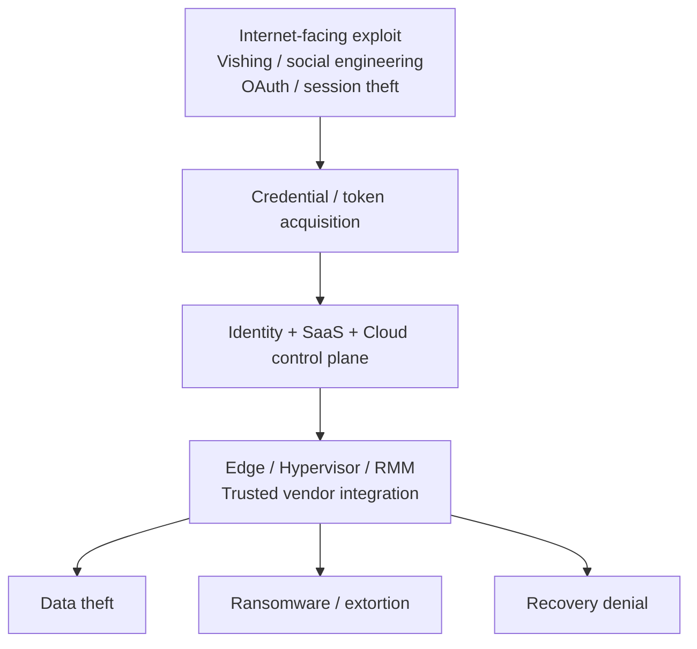

# Cross-report consensus matrix

This matrix records **evidence prominence**, not vendor quality, product capability, or a security score.

## Evidence labels

- **Major** — the source makes the theme a primary finding, dedicated trend, or repeated recommendation.
- **Observed** — the source explicitly supports the theme, but it is not a dominant focus.
- **Not emphasized** — the reviewed material does not materially emphasize the theme. This does **not** mean the theme is absent from the publisher's broader research.

No numeric score is calculated from these labels.

Because each publisher uses a different observation population, methodology, geography, and incident definition, percentages are intentionally **not normalized or ranked across vendors**.

## 2026 consensus map

| Theme | M-Trends | DBIR | CrowdStrike | Unit 42 | Microsoft | IBM | ENISA | Independent conference signal |
|---|---|---|---|---|---|---|---|---|
| AI accelerates offensive activity | Major | Major | Major | Major | Major | Major | Observed | RSAC / Black Hat / DEF CON / FIRST |
| Identity / credential / token abuse | Major | Major | Major | Major | Major | Major | Observed | RSAC / Black Hat / FIRST |
| Vulnerability / exposed-asset exploitation | Major | Major | Major | Major | Major | Major | Major | Black Hat / DEF CON |
| Edge / network appliance | Major | Observed | Major | Major | Observed | Observed | Observed | DEF CON |
| Cloud / SaaS | Major | Major | Major | Major | Major | Major | Observed | RSAC / Cloud Village / FIRST |
| Supply chain / trusted connectivity | Major | Major | Observed | Major | Major | Observed | Major | RSAC / Black Hat / FIRST |
| Ransomware / extortion | Major | Major | Major | Major | Major | Major | Major | FIRST / DEF CON |
| Recovery / resilience | Major | Major | Major | Major | Major | Major | Major | RSAC / FIRST |
| Machine-speed response pressure | Major | Observed | Major | Major | Major | Major | Observed | Black Hat / FIRST |
| Long-term / non-EDR telemetry | Major | Observed | Major | Major | Major | Observed | Observed | FIRST / DEF CON |

## Evidence anchors

These are representative anchors for the labels above. The individual report notes contain the observation windows, limitations, and primary-source links needed to interpret them correctly.

| Source | Representative evidence anchor | Report note |
|---|---|---|
| M-Trends 2026 | 500k+ hours of 2025 investigations; exploits remained the leading initial infection vector; voice phishing rose; edge persistence and long dwell time are emphasized; median initial-access handoff reached 22 seconds. | [M-Trends](../reports/01-m-trends-2026.md) |
| Verizon DBIR 2026 | 31% of breaches began with software vulnerabilities; 48% involved ransomware; generative AI was observed augmenting **15 distinct attack techniques**; mobile-origin phishing simulations produced higher click rates. | [DBIR](../reports/02-verizon-dbir-2026.md) |
| CrowdStrike 2026 | Fastest observed eCrime breakout was 27 seconds; AI-enabled adversary activity increased 89%; state-nexus cloud-conscious intrusions increased 266%; edge devices were heavily represented in China-nexus exploitation. | [CrowdStrike](../reports/03-crowdstrike-global-threat-report-2026.md) |
| Unit 42 2026 | Identity weaknesses materially contributed to nearly 90% of investigations; 87% of intrusions crossed multiple attack surfaces; browser activity, SaaS, trusted connectivity, and rapidly shrinking time-to-exfiltration are central themes. | [Unit 42](../reports/04-unit42-global-ir-2026.md) |
| Microsoft MDDR 2025 | AI-driven phishing, destructive cloud campaigns, hybrid ransomware, identity/cloud resilience, and automated response are prominent; Microsoft IR also highlights phishing/social engineering, unpatched web assets, and exposed remote services as initial-access paths. | [Microsoft](../reports/05-microsoft-digital-defense-report-2025.md) |
| IBM X-Force 2026 | Public-facing exploitation increased 44% YoY; 56% of disclosed vulnerabilities did not require authentication; 300k AI-chatbot credentials were observed for sale; active ransomware groups increased 49%. | [IBM](../reports/06-ibm-xforce-2026.md) |
| ENISA 2026 | Ransomware remained the most impactful short-term incident type; public administration and NIS2 essential/important entities feature heavily; geopolitical DDoS and malicious use of emerging AI are emphasized. | [ENISA](../reports/07-enisa-threat-landscape-2026.md) |

## Supplemental corroboration

The core seven remain the primary consensus set. Supplemental 2026 research strengthens or refines specific domains:

| Domain | Supplemental evidence |
|---|---|
| Cloud / CI/CD / forensic readiness | [Google Cloud Threat Horizons H1 2026](../supplemental/01-google-cloud-threat-horizons-h1-2026.md) |
| Identity / AD / off-hours response / log retention | [Sophos Active Adversary 2026](../supplemental/02-sophos-active-adversary-2026.md) |
| SaaS trust / token theft / living-off-cloud / DDoS | [Cloudflare Threat Report 2026](../supplemental/03-cloudflare-threat-report-2026.md) |
| Current 2026 availability pressure | [Cloudflare DDoS H1 2026](../supplemental/04-cloudflare-ddos-h1-2026.md) |
| API / application / DNS attack surface | [Akamai Apps/APIs/DDoS 2026](../supplemental/05-akamai-app-api-ddos-2026.md) |
| Agent / MCP / machine identity | [Akamai Agentic Threat Landscape 2026](../supplemental/06-akamai-agentic-threat-landscape-2026.md) |
| AI / MCP / edge / hybrid convergence | [Check Point Cyber Security Report 2026](../supplemental/07-check-point-cyber-security-report-2026.md) |
| Exploit velocity / network telemetry | [Fortinet Global Threat Landscape 2026](../supplemental/08-fortinet-global-threat-landscape-2026.md) |

These sources notably strengthen three conclusions already present in the architecture:

- **API and browser surfaces deserve explicit inventory and telemetry**, not just application-level WAF coverage.
- **Agentic AI belongs inside the Identity and Control Planes**, with continuous authorization at tool/API boundaries.
- **Availability defense is increasingly machine-speed**, especially for DDoS and rapid exploitation.

## What qualifies as a cross-source signal?

A repository-level conclusion is treated as a **cross-source signal** when at least one of these is true:

1. Multiple independent report populations explicitly support the theme.
2. A report population and independent conference/research material converge on the same architectural concern.
3. Different sources observe different stages of the same attack path.

This is stronger than counting how many vendors mention a keyword.

## Cross-source synthesis

The shared attack path can be summarized as:



AI does not replace this path. Across the reviewed evidence, it primarily lowers cost and time in reconnaissance, lure generation, code/tool creation, data processing, troubleshooting, and decision-making.

## What changed from the classic intrusion model

### Classic model

```text
Phishing → Endpoint malware → AD → Data / Ransomware
```

### 2026 model

```text
Exploit / Vishing / OAuth / Session Theft
  → IdP / Cloud / SaaS
  → Edge / Hypervisor / RMM / Vendor Integration
  → Data + Identity + Backup + Recovery
```

This is why endpoint-centric coverage remains necessary but is no longer sufficient.

## Architectural conclusion

The recurring structural issue is **control-plane abuse**:

- valid or alternate authentication material;
- delegated trust and SaaS connectivity;
- management interfaces with weaker telemetry;
- non-human identities with long-lived credentials;
- recovery systems sharing the same trust boundary as production.

That leads directly to the [security-plane model](../architecture/security-planes.md).
