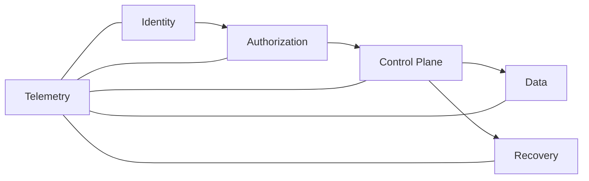
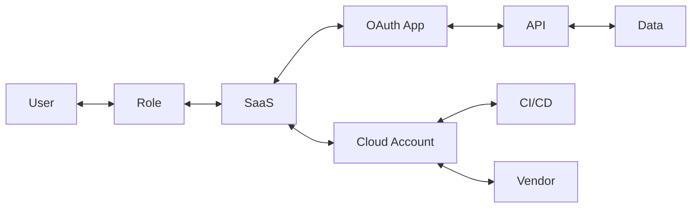

# Enterprise Security Architecture implications

The 2026 evidence suggests a shift from product-centric security architecture toward **trust-boundary and control-plane architecture**.

## 1. Redefine Tier 0

Domain Controllers are no longer the only systems that deserve Tier-0 treatment.

Treat the following as Tier-0 or equivalent high-impact control planes:

- Enterprise IdP / federation.
- Privileged access platform.
- Cloud organization / tenant root.
- Hypervisor / virtualization management.
- Backup / recovery control plane.
- Network-security management plane.
- CI/CD signing and release authority.
- High-privilege SaaS integration administration.
- AI-agent orchestration with privileged tool access.

A compromise of any of these systems can change the security state of many other systems without directly compromising each endpoint.

## 2. Identity-first, not identity-only

Identity is the practical perimeter, but identity controls alone are insufficient.



Design principles:

- Phishing-resistant MFA.
- JIT/PIM rather than standing admin.
- Conditional and continuous access evaluation.
- Short-lived human and workload credentials.
- Machine-identity inventory.
- OAuth/API-grant governance.
- Session/token monitoring.
- Strong recovery and helpdesk identity proofing.

## 3. Make edge and virtualization first-class telemetry

"An EDR agent cannot be installed" is not a reason to accept invisibility.

Required capabilities:

- Authentication/admin-log forwarding.
- Configuration-change monitoring.
- Management-plane network segmentation.
- Dedicated privileged admin paths.
- Firmware/appliance exposure management.
- Baseline and anomaly detection for management activity.

## 4. Model cloud and SaaS as a relationship graph

A flat asset inventory misses the attack path.



Attackers exploit relationships: delegation, token scope, trust policy, role assumption, integration credentials, and management access.

## 5. Design recovery as an isolated security plane

**Backup is not recovery.**

A credible recovery design includes:

- Immutable or offline recovery points.
- A separate identity boundary.
- Separate administrative credentials.
- Restore testing.
- IdP-loss and hypervisor-loss scenarios.
- SaaS configuration/data recovery.
- Independent audit trail for destructive recovery-plane actions.

See [Recovery Architecture](../architecture/recovery.md).

## 6. Detection-as-Code plus bounded automation

Attack progression in seconds or minutes makes a fully manual SOC structurally disadvantaged.

A practical automation ladder:

1. Enrich.
2. Correlate.
3. Score confidence.
4. Execute reversible containment.
5. Escalate destructive/high-impact actions to a human.

The key is not "fully autonomous SOC." It is **pre-authorized, reversible, observable response for high-confidence scenarios**.

## 7. Treat AI agents as privileged software identities

Before evaluating model quality, ask:

- Who or what is the agent?
- Which tools can it invoke?
- Which data can it read/write?
- Can it delegate to another agent?
- Can it create or refresh credentials?
- Is every action attributable and auditable?
- Can a human quickly revoke its authority?

See [Agent Security](../ai-security/agent-security.md).

## 8. Separate architecture principles from provider implementation

Provider-specific services change faster than architecture principles.

Start with:

```text
Need: remove standing privilege
Principle: time-bound elevation
Implementation: Entra PIM / AWS federated temporary roles / GCP short-lived federation
```

See [Cloud Controls](../architecture/cloud-controls.md) for concrete examples.