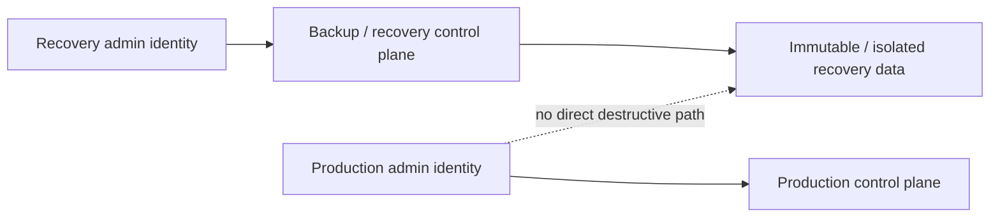

# Azure / AWS / GCP control mapping

This document maps **provider-neutral security architecture objectives** to representative native controls in Microsoft Azure / Entra, AWS, and Google Cloud.

It is **not** a claim of feature equivalence. Similar-looking services often differ in scope, identity model, enforcement point, licensing, and operational behavior.

## Control map

| Architecture objective | Microsoft Azure / Entra | AWS | Google Cloud |
|---|---|---|---|
| Workforce federation | Microsoft Entra ID federation / external identities | IAM Identity Center with internal or external IdP | Workforce Identity Federation |
| Short-lived workforce access | Entra-issued tokens + Conditional Access session controls | IAM Identity Center / role sessions with temporary credentials | Workforce Identity Federation tokens / IAM |
| JIT privileged access | Entra Privileged Identity Management (PIM) | Temporary role sessions plus an approval workflow designed by the organization; no direct 1:1 PIM equivalent | Privileged Access Manager (PAM) |
| Phishing-resistant access | Conditional Access authentication strengths; passkeys/FIDO2/CBA | Passkeys/security keys; federated IdP MFA policy | Enforce at external IdP for federated workforce plus IAM / context controls |
| Workload identity without static keys | Managed identities; Workload Identity Federation | IAM roles / STS temporary credentials; Roles Anywhere / OIDC/SAML federation where appropriate | Workload Identity Federation; attached service accounts |
| Non-human identity policy | Workload identities / service principals; Conditional Access for supported workload identities | IAM role trust policy + conditions + session controls | Workload Identity Pools + attribute mappings/conditions |
| Detect external / excessive access | Entra ID Governance, access reviews, Azure RBAC review patterns | IAM Access Analyzer | IAM Recommender / Policy Intelligence patterns |
| Organization guardrails | Management groups + Azure Policy | AWS Organizations + SCPs/RCPs | Resource hierarchy + Organization Policy |
| Context-aware access | Conditional Access | IAM policy conditions + IdP/session context | Access Context Manager + IAM Conditions |
| Control-plane audit | Azure Activity Log + Entra audit/sign-in logs | CloudTrail + service-specific audit logs | Cloud Audit Logs |
| Organization-wide audit strategy | Diagnostic settings / central Log Analytics or SIEM architecture | Organization trails + centralized S3/CloudWatch/EventBridge | Aggregated sinks / centralized logging architecture |
| Cloud posture / exposure | Defender for Cloud + Azure Policy ecosystem | Security Hub CSPM + Config ecosystem | Security Command Center + Organization Policy ecosystem |
| Recovery separation | Separate privileged identities/subscriptions and protected backup authority | Separate backup/recovery account strategy + restricted roles | Separate project/folder/identity boundary + protected backup authority |

## 1. Identity Plane

### Microsoft Azure / Entra

Recommended pattern:

```text
Enterprise identity
→ Conditional Access
→ phishing-resistant authentication strength
→ PIM activation
→ Azure RBAC / Entra role
→ Activity + Entra audit telemetry
```

Microsoft documents Authentication Strength as a Conditional Access control capable of requiring a **phishing-resistant** method set.

Entra PIM is the strongest native fit in the three-cloud comparison for explicit **eligible → activate → time-bound privilege** workflows.

For software workloads:

- prefer **managed identities** when running on Azure;
- prefer **Workload Identity Federation** for supported external workloads such as GitHub Actions, Kubernetes, or non-Azure compute;
- avoid reusable client secrets where federation or managed identity is practical.

Important limitation:

> Conditional Access treatment differs between users, agents, workload identities, managed identities, and multitenant applications. Do not assume a user-scoped CA policy automatically governs every non-human identity.

Primary references:

- https://learn.microsoft.com/en-us/entra/id-governance/privileged-identity-management/
- https://learn.microsoft.com/en-us/entra/identity/authentication/concept-authentication-strength-how-it-works
- https://learn.microsoft.com/en-us/entra/identity/conditional-access/concept-conditional-access-users-groups
- https://learn.microsoft.com/en-us/entra/workload-id/workload-identity-federation

### AWS

AWS IAM best practices explicitly recommend:

- federation and **temporary credentials** for human users;
- IAM roles and **temporary credentials** for workloads;
- phishing-resistant MFA such as passkeys/security keys where applicable;
- least privilege;
- IAM Access Analyzer;
- removal of unused users, roles, permissions, policies, and credentials.

Recommended pattern:

```text
Enterprise IdP
→ IAM Identity Center
→ Permission set / IAM role
→ temporary role session
→ AWS API
→ CloudTrail
```

For workloads:

```text
AWS compute
→ IAM role
→ temporary credentials

External workload
→ OIDC / SAML / X.509
→ STS / Roles Anywhere
→ temporary credentials
```

AWS does not provide a direct 1:1 equivalent to Entra PIM. The design objective should therefore be stated as:

> **minimize standing privilege and issue temporary privileged sessions through a controlled approval path**

rather than forcing product equivalence.

Primary references:

- https://docs.aws.amazon.com/IAM/latest/UserGuide/best-practices.html
- https://docs.aws.amazon.com/singlesignon/latest/userguide/what-is.html
- https://docs.aws.amazon.com/singlesignon/latest/userguide/howtogetcredentials.html
- https://docs.aws.amazon.com/IAM/latest/UserGuide/access-analyzer-findings.html

### Google Cloud

Google Cloud draws a useful architectural distinction:

- **Workforce Identity Federation** — external human/workforce identities.
- **Workload Identity Federation** — software/workload identities.
- **Privileged Access Manager** — time-bound privileged access.
- **IAM Conditions / Access Context Manager** — contextual restrictions.

Workforce and Workload Identity Federation both support attribute mappings and conditions, which are important for preventing a **confused deputy** problem with multi-tenant identity providers.

Recommended pattern:

```text
Workforce IdP
→ Workforce Identity Federation
→ IAM role binding / condition
→ Google Cloud API
→ Cloud Audit Logs

External workload identity
→ Workload Identity Federation
→ short-lived Google credentials
→ scoped IAM
```

Primary references:

- https://cloud.google.com/iam/docs/workforce-identity-federation
- https://cloud.google.com/iam/docs/workload-identity-federation
- https://cloud.google.com/iam/docs/pam-overview
- https://cloud.google.com/access-context-manager/docs/overview

## 2. Control Plane

The provider-specific implementation differs, but the architecture objective is consistent:

```text
Organization / Tenant Root
        ↓
Central guardrails
        ↓
Account / Subscription / Project
        ↓
Workload policy
```

### Azure

- Management Groups
- Azure Policy
- RBAC
- resource locks where appropriate
- deployment-policy enforcement through IaC and CI/CD

### AWS

- AWS Organizations
- Service Control Policies (SCPs)
- Resource Control Policies (RCPs), where applicable
- IAM permissions boundaries
- account-level IAM/resource policies

An SCP is a **maximum-permission guardrail**; it does not grant permissions.

### Google Cloud

- Organization → Folder → Project hierarchy
- Organization Policy
- IAM deny / allow policies and conditions
- service perimeters where appropriate

The practical goal is to prevent a compromised local administrator from silently escaping organization-level constraints.

## 3. Telemetry Plane

### Minimum control-plane evidence

| Evidence | Azure / Entra | AWS | Google Cloud |
|---|---|---|---|
| Authentication | Entra sign-in / risk logs | IAM Identity Center / IdP + CloudTrail context | Workforce federation / IdP + Cloud Audit Logs |
| IAM changes | Entra audit + Azure Activity | CloudTrail | Cloud Audit Logs |
| Resource changes | Azure Activity Log | CloudTrail | Cloud Audit Logs |
| Org guardrail changes | Management Group / Policy activity | Organizations / CloudTrail | Organization Policy / Audit Logs |
| Workload identity use | Managed identity / service principal telemetry | AssumeRole / STS events | STS / WIF + Audit Logs |
| Privilege activation | PIM audit | Role/session issuance + approval-system audit | PAM audit |

For AWS, an **organization trail** provides a uniform cross-account CloudTrail delivery strategy. AWS also notes that trails provide records beyond the default 90-day event-history window.

For Google Cloud federation, detailed token-exchange audit logging can be enabled and should be considered for high-value federation paths.

## 4. Recovery Plane

Do not let production-admin authority automatically imply recovery-admin authority.

Provider-neutral design:



Implementation patterns can include:

- separate account/subscription/project ownership;
- separate privileged role sets;
- separate break-glass credentials;
- immutable retention;
- dual control for destructive backup actions;
- audit streams protected from the same authority that administers production.

## 5. Multi-cloud architecture standard

Rather than standardizing product names, standardize these properties:

| Property | Required design question |
|---|---|
| Identity source | Is workforce identity federated from an authoritative IdP? |
| Credential lifetime | Are human and workload credentials short-lived where practical? |
| Privilege lifetime | Is privileged access standing or time-bound? |
| Trust condition | What issuer, tenant, repo, workload, device, network, or attribute is trusted? |
| Guardrail | Can local administrators exceed organization policy? |
| Audit | Can every privileged action be attributed to a principal and session? |
| Revocation | Can identity, token, role session, and integration access be cut quickly? |
| Recovery | Can recovery survive compromise of production identity/control plane? |

## 6. CI/CD pattern

A strong multi-cloud baseline for CI/CD is:

```text
CI/CD job identity
→ OIDC/federated assertion
→ cloud workload identity
→ short-lived role/token
→ narrowly scoped deployment authority
→ auditable deployment event
```

Avoid:

```text
GitHub/GitLab/Jenkins secret store
→ long-lived Azure client secret / AWS access key / GCP service-account key
```

when federation is supported.

## Review checklist

- Is workforce identity federated rather than duplicated?
- Are workload credentials short-lived?
- Is standing administrator access minimized?
- Are issuer/tenant/repository/workload conditions explicit?
- Can external and unused access be identified?
- Are organization-level guardrails centrally managed?
- Are control-plane logs centralized and retained?
- Can privileged sessions and tokens be revoked quickly?
- Do CI/CD systems use federation rather than static cloud keys?
- Is the Recovery Plane protected by a distinct trust boundary?
