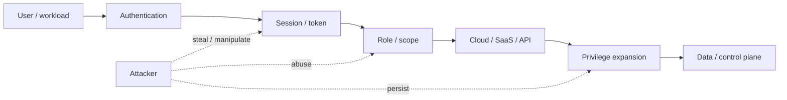

# Identity architecture

Identity is the most consistent cross-source theme in the 2026 evidence set.

The important change is that "identity" now means more than employee accounts.

## Identity inventory

Maintain one logical inventory covering:

| Class | Examples | Typical risk |
|---|---|---|
| Human workforce | Employees, admins, contractors | Phishing, vishing, recovery abuse |
| Privileged human | Cloud/global admin, security admin | High blast radius |
| Workload identity | IAM roles, service accounts, managed identities | Long-lived or over-privileged machine access |
| Application identity | OAuth clients, service principals | Delegated access, persistence |
| Session material | Cookies, access/refresh tokens | MFA bypass after authentication |
| CI/CD identity | GitHub/GitLab runners, deploy roles | Supply-chain and release compromise |
| AI agent identity | Agent runtime, connector identity | Tool abuse, delegated action |

## Core design principles

### 1. Prefer federation and temporary credentials

Long-lived credentials are attractive because they decouple access from an active authentication event.

Provider examples:

- Microsoft Entra: federation, Conditional Access, PIM.
- AWS: federation and temporary role credentials; IAM Identity Center for centralized workforce access.
- Google Cloud: Workforce Identity Federation for users and Workload Identity Federation for workloads.

### 2. Remove standing privilege

Use time-bound elevation where the platform supports it.

- Entra PIM provides eligible/JIT privileged access.
- Google Cloud Privileged Access Manager provides time-bound elevation with optional approval and justification.
- AWS temporary role sessions and centralized federation reduce dependency on long-lived IAM-user credentials.

### 3. Protect account recovery and helpdesk processes

Phishing-resistant MFA does not solve weak recovery.

High-value accounts should have:

- stronger identity-proofing for reset/recovery;
- separate verification channels;
- documented exception handling;
- auditable operator actions;
- risk-based delay or secondary approval for sensitive resets.

### 4. Govern OAuth and delegated access

OAuth applications and SaaS integrations should have:

- owner.
- business purpose.
- approved scopes.
- review date.
- credential/token lifetime.
- revocation procedure.
- audit source.

M-Trends explicitly recommends restricting end-user consent to unverified third-party applications.

### 5. Monitor session and token use

Password and MFA telemetry is not enough once authentication succeeds.

Relevant ATT&CK:

- [T1078 Valid Accounts](https://attack.mitre.org/techniques/T1078/)
- [T1528 Steal Application Access Token](https://attack.mitre.org/techniques/T1528/)
- [T1550 Use Alternate Authentication Material](https://attack.mitre.org/techniques/T1550/)
- [T1098 Account Manipulation](https://attack.mitre.org/techniques/T1098/)

## Identity attack graph

## Architecture review questions

- Which identities are not tied to an accountable owner?
- Which credentials are long-lived?
- Which identities can reach Tier-0 systems?
- Which privileged sessions can be revoked within minutes?
- Which OAuth grants allow cross-service access?
- Can a service identity create another credential?
- Can an AI agent assume or refresh privileged authority?
- Are break-glass identities isolated from the normal federation dependency?

## Primary references

- Microsoft Entra PIM: https://learn.microsoft.com/en-us/entra/id-governance/privileged-identity-management/
- AWS IAM best practices: https://docs.aws.amazon.com/IAM/latest/UserGuide/best-practices.html
- Google Cloud Workforce Identity Federation: https://cloud.google.com/iam/docs/workforce-identity-federation
- Google Cloud Workload Identity Federation: https://cloud.google.com/iam/docs/workload-identity-federation
- MITRE ATT&CK identity/token techniques: https://attack.mitre.org/techniques/