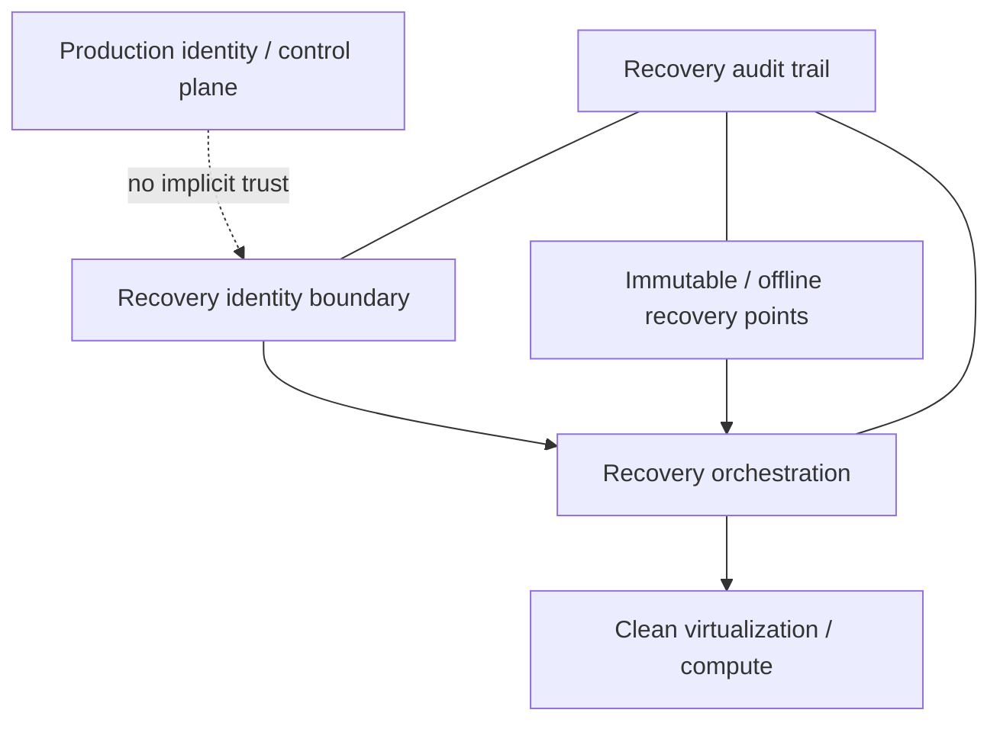

# Recovery architecture

**Backup is not recovery.**

The 2026 evidence set repeatedly reinforces resilience, ransomware, destructive activity, and recovery denial. A backup copy is useful only if the organization can authenticate, reach, trust, and restore it after a compromise.

## Recovery Plane model

## Design principles

### Separate identity

Do not assume the production IdP will be trustworthy or available.

Options include:

- dedicated recovery identities;
- offline/break-glass credentials;
- hardware-backed authentication;
- separately stored recovery procedures.

### Separate administrative authority

Production administrators should not automatically have unrestricted ability to delete recovery points.

Use:

- separate roles;
- dual control for destructive operations;
- immutable retention;
- delayed deletion where supported;
- strong alerting on recovery-policy changes.

### Test loss of control planes

Restore exercises should include scenarios such as:

- Enterprise IdP unavailable.
- Hypervisor management compromised.
- Network-security management unavailable.
- Backup catalog or orchestration compromised.
- Cloud root/organization administration affected.
- SaaS tenant configuration damaged.

### Recovery telemetry is security telemetry

Collect and alert on:

- backup policy changes;
- immutability changes;
- retention changes;
- mass deletion attempts;
- restore operations;
- replication disablement;
- recovery-account use.

## Recovery readiness test

A useful test is:

> Can a designated recovery team rebuild critical services using trusted identities and trusted recovery points without depending on the compromised production control plane?

If the answer is no, the environment has backups but not an independently trustworthy Recovery Plane.

## Metrics

- Restore success rate.
- Tested RTO/RPO versus target.
- Percentage of critical systems with isolated recovery paths.
- Percentage of recovery operations requiring separate privileged identity.
- Time to establish trusted admin access after IdP loss.
- Age of last full recovery exercise.

## Related analysis

- [Enterprise Architecture implications](../analysis/enterprise-architecture-implications.md)
- [2026 Security Priorities](../operations/security-priorities.md)