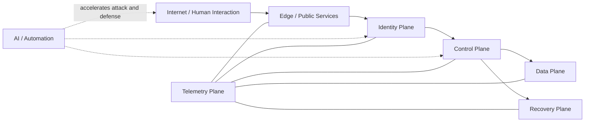
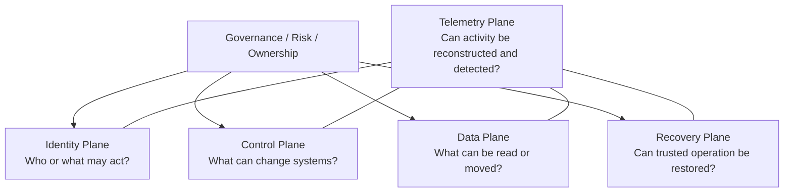
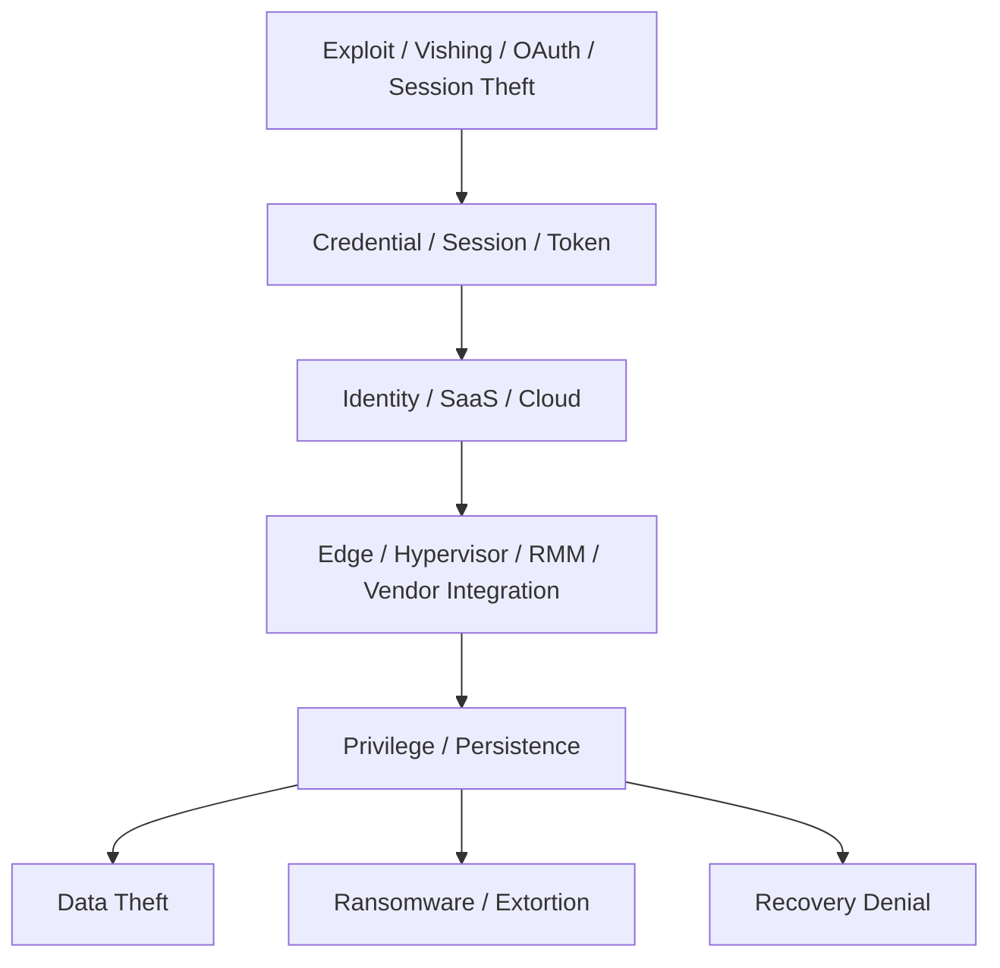
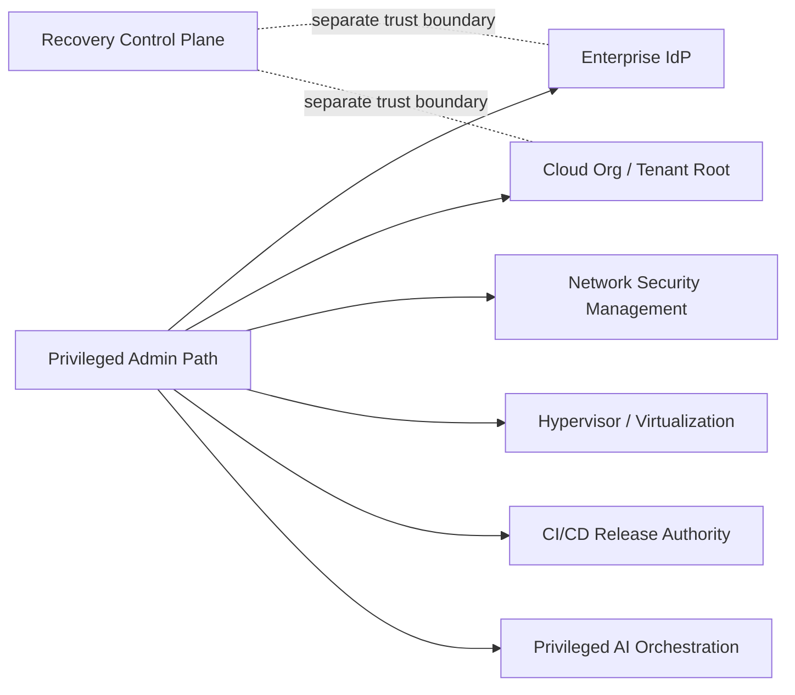
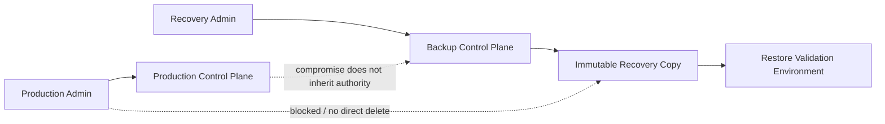
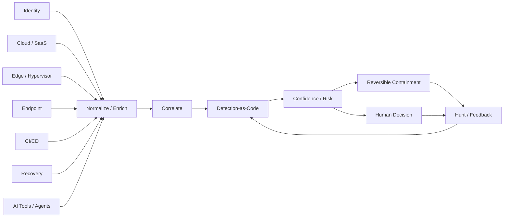

# Enterprise Security Reference Architecture

This page turns the 2026 threat evidence into a single architecture view.

The model is deliberately provider-neutral. Azure, AWS, GCP, SaaS, on-premises virtualization, endpoint, CI/CD, and AI-agent systems can all be placed into the same security planes.

## 1. Threat-to-architecture view



The 2026 evidence base repeatedly points to the same structural problem:

> attackers do not need to defeat every control; they need a reachable path to a sufficiently privileged control plane.

## 2. Five security planes



### Identity Plane

Includes:

- workforce identities;
- administrators;
- service accounts;
- workload identities;
- OAuth applications;
- API keys and tokens;
- CI/CD identities;
- AI agents and delegated identities.

Primary controls:

- federation;
- phishing-resistant MFA;
- JIT / time-bound privilege;
- short-lived workload credentials;
- token/session governance;
- non-human identity ownership.

### Control Plane

Includes:

- cloud tenant/org/account administration;
- hypervisor and virtualization management;
- network/firewall/VPN management;
- SaaS administration;
- CI/CD release authority;
- backup administration;
- AI-agent tool orchestration.

Primary controls:

- Tier-0 segmentation;
- organization guardrails;
- privileged access paths;
- change approval;
- least privilege;
- configuration policy;
- control-plane audit.

### Data Plane

Includes:

- application data;
- databases;
- object storage;
- SaaS content;
- secrets;
- model/context data;
- logs containing sensitive information.

Primary controls:

- data classification;
- encryption;
- access policy;
- DLP;
- scoped API access;
- exfiltration monitoring.

### Recovery Plane

Includes:

- backup control plane;
- immutable recovery copies;
- identity recovery;
- configuration/state recovery;
- alternate administration path.

Primary principle:

> **Production compromise must not automatically imply recovery compromise.**

### Telemetry Plane

Collects evidence from every other plane.

Minimum high-value sources:

- IdP authentication/audit;
- cloud control-plane audit;
- SaaS audit;
- endpoint/XDR;
- edge/network appliance admin events;
- hypervisor/virtualization events;
- backup/recovery administration;
- CI/CD;
- AI agent/tool invocation.

## 3. 2026 attack path



This path is intentionally broader than the classic:

```text
Phishing → Endpoint Malware → AD → Ransomware
```

The modern architecture has to account for valid authority, delegated trust, SaaS/API relationships, non-human identities, and management systems outside EDR coverage.

## 4. Tier-0 / high-trust boundary



Candidates for Tier-0-equivalent treatment:

- enterprise IdP / federation;
- privileged access platform;
- cloud organization / tenant root;
- hypervisor management;
- network-security management;
- CI/CD signing/release authority;
- backup/recovery administration;
- privileged AI-agent orchestration.

## 5. Recovery isolation



Recovery design questions:

- Can production administrators delete recovery copies?
- Does backup administration use the same IdP and same privileged group?
- Can a compromised hypervisor administrator destroy the only recovery path?
- Are restore procedures tested after identity/control-plane loss?
- Can the organization rebuild trusted administration before reconnecting production?

## 6. Telemetry-to-response loop



The operating principle is:

```text
machine-speed evidence
→ automated enrichment/correlation
→ bounded reversible action
→ human approval for destructive/high-impact action
```

## 7. Multi-cloud implementation

Use the provider-specific mapping in [cloud-controls.md](cloud-controls.md).

The architecture should standardize **properties**, not product names:

- authoritative identity source;
- short credential lifetime;
- short privilege lifetime;
- explicit trust conditions;
- organization-level guardrails;
- attributable audit evidence;
- rapid revocation;
- isolated recovery.

## 8. Framework linkage

- [MITRE ATT&CK](../frameworks/mitre-attack.md) — adversary behavior and detection hypotheses.
- [NIST CSF 2.0](../frameworks/nist-csf.md) — governance and cybersecurity outcomes.
- [CIS Controls v8.1](../frameworks/cis-controls.md) — prioritized safeguards.
- [Detection Engineering](../operations/detection-engineering.md) — operationalization.
- [AI Agent Security](../ai-security/agent-security.md) — privileged non-human identity model.
