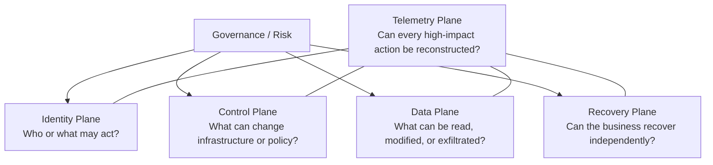

# Security planes

The 2026 evidence is easier to reason about when security architecture is separated into four primary planes with one cross-cutting telemetry plane.

## Identity Plane

Scope:

- Human identities.
- Service accounts and workload identities.
- OAuth clients and delegated grants.
- API keys, access tokens, refresh tokens, session cookies.
- AI agents and automation identities.
- Break-glass identities.

Key question:

> Can we prove who or what is acting, with what authority, for how long?

Primary design goals:

- Strong identity proofing.
- Phishing-resistant authentication.
- Short-lived credentials.
- Just-in-time privilege.
- Explicit ownership.
- Fast revocation.
- Auditable delegation.

## Control Plane

Scope:

- Cloud organization / tenant administration.
- IAM policy.
- Hypervisor and virtualization management.
- Network-security management.
- Backup orchestration.
- CI/CD and release authority.
- SaaS administration.
- AI-agent orchestration and connector configuration.

Key question:

> Which identities or systems can change the security state of many other systems?

These systems often deserve Tier-0 treatment because control-plane compromise creates asymmetric blast radius.

## Data Plane

Scope:

- Application data.
- Object stores.
- Databases.
- File systems.
- Mailboxes and collaboration data.
- Source code and package registries.
- Model inputs/outputs and vector stores.

Key question:

> Which paths allow data to be read, modified, or exfiltrated without compromising each workload individually?

## Recovery Plane

Scope:

- Backup repositories.
- Replication.
- Immutable copies.
- Recovery orchestration.
- Identity recovery.
- Hypervisor recovery.
- SaaS configuration and data recovery.

Key question:

> Can recovery still operate when production identity and management planes are compromised?

See [Recovery Architecture](recovery.md).

## Telemetry Plane

Telemetry crosses all other planes.

Required classes:

- Authentication and privilege.
- Cloud API / control-plane operations.
- SaaS audit.
- Edge and network-device administration.
- Hypervisor administration.
- Backup and restore operations.
- CI/CD actions.
- AI-agent/tool invocation.

Key question:

> Can investigators reconstruct actor, authorization, action, target, result, and lineage?

## Tier-0 heuristic

A system should be considered Tier 0 or equivalent if compromising it allows an attacker to:

- issue or modify identities/credentials;
- change authorization globally;
- administer multiple security boundaries;
- disable high-value telemetry;
- alter or destroy recovery capability;
- sign or publish trusted software;
- instruct privileged agents to act across enterprise systems.

Tier 0 is therefore a **blast-radius concept**, not a product category.