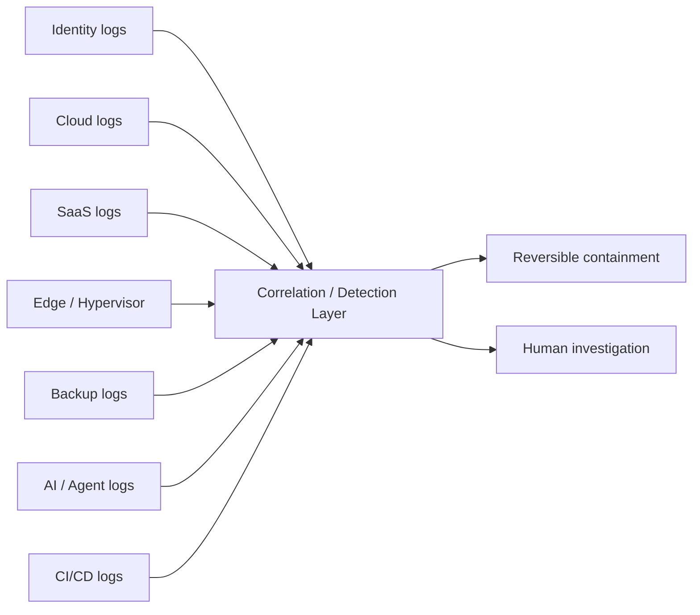

# Telemetry architecture

2026 reporting repeatedly highlights attacks that cross endpoint, identity, cloud, SaaS, edge, virtualization, and recovery systems. The telemetry model therefore has to follow **authority and attack paths**, not just device classes.

## Required telemetry domains

| Domain | Minimum useful evidence | High-value detections |
|---|---|---|
| Identity / IdP | Sign-in, MFA, reset, role changes, app consent, token events | Impossible/atypical session use, MFA recovery abuse, privileged-role activation |
| Cloud control plane | API calls, IAM/policy changes, org/account config | New trust, new admin, public exposure, logging disablement |
| SaaS | Login, OAuth grant, admin changes, exports | New high-scope app, bulk export, anomalous delegated access |
| Edge / network | Admin login, config change, firmware/update, VPN | New admin path, unexpected config, persistence indicators |
| Hypervisor | Admin auth, VM lifecycle, datastore access, shell/API | Rogue VM, datastore copy, new privileged account |
| Endpoint | Process, network, identity, file, memory | Malware, credential access, lateral movement |
| CI/CD | Workflow run, actor, OIDC/federation, secret access, release/signing | Unexpected runner, new deploy identity, unsigned/unapproved release |
| Backup / recovery | Policy, deletion, immutability, restore, admin | Mass delete, retention reduction, replication disablement |
| AI / agent | Prompt lineage, tool call, principal, scope, target, result | Over-broad tool use, unexpected data access, token misuse |

## The event model

Normalize high-impact actions around six fields:

```text
Actor
Authorization
Action
Target
Result
Lineage / correlation ID
```

For AI-agent systems, add:

```text
Agent identity
Model/session
Tool
Delegated user/service identity
Requested scope
Human approval state
```

## Correlation model



## Retention

Retention should be driven by:

- dwell-time scenarios;
- regulatory needs;
- investigation requirements;
- cost tiering;
- high-value control-plane risk.

M-Trends' emphasis on long-lived persistence in infrastructure outside normal endpoint telemetry is a strong argument against applying the shortest retention tier to edge, identity, or virtualization logs.

## Detection design rule

Every Tier-0 control should have:

1. an authoritative log source;
2. an owner;
3. a minimum retention requirement;
4. a known-good baseline;
5. high-impact change detections;
6. a tested containment path.

See [Detection Engineering](../operations/detection-engineering.md).