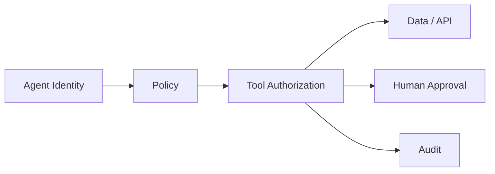

# RSAC 2026

## Positioning

RSAC is useful as an **enterprise adoption and governance signal**. It is less about proving attack prevalence and more about showing which problems are moving into mainstream CISO, architecture, product, and operating-model agendas.

## 2026 signals

### Agentic AI becomes an identity problem

Official 2026 sessions included topics such as:

- agent identity;
- identity-centric security for autonomous systems;
- enterprise AI governance;
- agent behavior and posture;
- securing MCP/agent integrations.

RSAC's 2026 Innovation Sandbox winner, Geordie AI, focused on visibility and governance of enterprise AI-agent footprints.

This reinforces a broader architecture shift:

```text
AI security
≠ only prompt filtering

AI security
= identity
+ authorization
+ tool access
+ data boundary
+ auditability
+ human approval
```

### Identity fabric expands beyond humans

The official agenda included explicit discussion of machine identity and AI-agent identity alongside workforce/customer identity.

For architecture, that means the identity inventory should include:

- humans;
- workloads;
- service principals;
- OAuth clients;
- automation;
- AI agents.

### AI supply chain and standards become enterprise concerns

Official sessions included vendor-neutral work on enterprise AI security, including agentic identity, threat detection, model verification, incident response, and supply-chain security.

## Interpretation for enterprise architects

RSAC suggests that agentic AI is transitioning from experimentation into an enterprise platform problem.

The reusable design pattern is:



The correct integration point is existing IAM, data governance, platform engineering, and SecOps—not a parallel AI-only security stack.

## Evidence caveat

Conference agendas show **interest, investment, and emerging practice**, not incident prevalence. They should be used as forward-looking signals and validated against incident/breach reports.

## Sources

- https://www.rsaconference.com/events/2026-usa
- https://path.rsaconference.com/flow/rsac/us26/FullAgenda/page/catalog/session/1765809740965001q2tz
- https://path.rsaconference.com/flow/rsac/us26/FullAgenda/page/catalog/session/1756095334761001u5K4
- https://www.rsaconference.com/-/media/project/rsac/rsac-website/event-files/us26/daily-addendum/rsac2026_daily_addendum.pdf