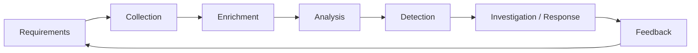

# FIRST Cyber Threat Intelligence Conference 2026

## Positioning

FIRST CTI is valuable because it connects intelligence to operations. The 2026 event explicitly focused on AI-driven CTI, detection engineering, intelligence standards, workshops, and practitioner workflows.

## Operational themes

### Intelligence must lead to action

The useful CTI lifecycle is:



The failure mode is producing reports that never become detection or control changes.

### Detection Engineering is part of CTI

The official workshop program included **Detection Engineering with Sigma**, covering event and correlation rules.

That makes the relationship explicit:

```text
Threat intelligence
→ behavioral hypothesis
→ portable detection
→ validation
→ investigation
```

### Cloud forensics is becoming normal IR work

The program included a hands-on open-source cloud-forensics workshop using GCP.

Architecture implication:

> Cloud audit and forensic evidence must be designed before an incident, not collected for the first time during one.

### AI-assisted CTI needs its own integrity model

FIRST's post-event summary highlighted AI-driven CTI.

LLM/RAG-based analysis can improve analyst productivity, but it introduces:

- poisoned OSINT;
- retrieval integrity risk;
- prompt/context manipulation;
- attribution uncertainty;
- false confidence.

AI output should therefore remain evidence-linked and reviewable.

## Enterprise operating-model takeaway

Mature SecOps should not separate CTI, detection engineering, and IR into document handoffs.

The target model is a closed feedback loop with shared data models, version-controlled rules, validation, and incident feedback.

## Evidence caveat

FIRST CTI represents practitioner methods and conference content; it does not provide a global attack-prevalence denominator.

## Sources

- https://www.first.org/conference/firstcti26/
- https://www.first.org/conference/firstcti26/program
- https://www.first.org/newsroom/releases/20260423