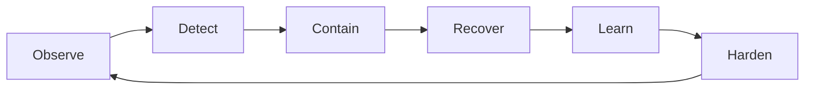

# FIRSTCON26

Theme: **Peak Defense: Building Adaptive Systems for Modern Threats**

FIRST describes the theme around adaptability, flexibility, resilience, and learning—qualities needed for defensive systems facing changing threats.

## Positioning

FIRSTCON is especially valuable for the **human and organizational layer of incident response**.

A modern SOC can have excellent telemetry and automation yet still fail because:

- decision rights are unclear;
- teams are overloaded;
- escalation is slow;
- cross-organizational information sharing fails;
- recovery responsibility is fragmented.

## 2026 signals

The program covered themes including:

- cloud-targeting adversaries;
- incident-response decision fatigue;
- CTI and machine-readable information exchange;
- vulnerability discovery-to-remediation workflows;
- insider threat;
- ransomware ecosystems;
- deception and adaptive defense;
- high-reliability and psychologically safe incident teams.

The conference's "adaptive systems" framing is particularly relevant to modern security operations.

## Security operations interpretation

### Automation does not eliminate decision design

Automation should reduce repetitive work, but the organization must still define:

- who may isolate a system;
- who may revoke identity;
- who may disable a critical integration;
- who declares a recovery event;
- which actions are pre-authorized;
- which actions require executive/business approval.

### High-reliability response requires human sustainability

SecOps design should include:

- clear roles;
- predictable escalation;
- manageable cognitive load;
- blameless learning;
- cross-team communication;
- decision records.

This is not separate from technical architecture. It determines whether detection and recovery controls actually work under pressure.

## Adaptive defense loop

## Evidence caveat

FIRSTCON provides operational-practice and community signals rather than breach prevalence statistics.

## Sources

- https://www.first.org/conference/2026/
- https://www.first.org/conference/2026/program
- https://www.first.org/conference/2026/welcome