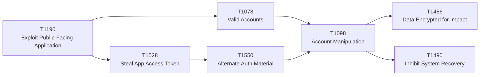

# MITRE ATT&CK crosswalk

This is a **repository-authored** mapping from the 2026 threat themes to representative MITRE ATT&CK Enterprise techniques.

It does **not** imply that the original publishers used ATT&CK in the same way.

## Core techniques

| 2026 theme | ATT&CK | Primary tactic / role | Why it matters in 2026 |
|---|---|---|---|
| Internet-facing exploitation | [T1190 Exploit Public-Facing Application](https://attack.mitre.org/techniques/T1190/) | Initial Access | ATT&CK explicitly covers exposed applications, cloud/container workloads, management services, edge appliances, and ESXi/vCenter. |
| Valid identity abuse | [T1078 Valid Accounts](https://attack.mitre.org/techniques/T1078/) | Initial Access / Persistence / Privilege Escalation / Defense Evasion | Stolen or abused credentials can provide broad access without malware and can span VPN, SaaS, cloud, network devices, and remote services. |
| OAuth/API token theft | [T1528 Steal Application Access Token](https://attack.mitre.org/techniques/T1528/) | Credential Access | Tokens can provide SaaS, cloud, container, CI/CD, and API access with the permissions of a user or service. |
| Session/token reuse | [T1550 Use Alternate Authentication Material](https://attack.mitre.org/techniques/T1550/) | Lateral Movement | Application access tokens, hashes, Kerberos tickets, and web-session cookies can bypass normal login and MFA flows. |
| Privilege persistence | [T1098 Account Manipulation](https://attack.mitre.org/techniques/T1098/) | Persistence / Privilege Escalation | Includes cloud credentials, cloud roles, device registration, account attributes, delegated access, and other access-preserving changes. |
| Recovery denial | [T1490 Inhibit System Recovery](https://attack.mitre.org/techniques/T1490/) | Impact | Covers disabling or deleting recovery mechanisms, snapshots, backups, and related services across endpoints, ESXi, network devices, and cloud. |
| Ransomware impact | [T1486 Data Encrypted for Impact](https://attack.mitre.org/techniques/T1486/) | Impact | Includes encryption of endpoints, virtual machines, datastores, and cloud-hosted data. |

## 2026 attack-path mapping



The point is not that every intrusion follows this exact chain. It is that several 2026 reports independently emphasize **reachable control planes and valid authority** rather than endpoint malware alone.

## Operational crosswalk

| ATT&CK | Telemetry | Detection hypothesis | Preventive architecture | Response action |
|---|---|---|---|---|
| T1190 | WAF/reverse proxy, application logs, edge admin logs, cloud audit, process/network telemetry | Internet-facing service shows exploitation indicators followed by new admin/API activity | External attack-surface inventory, exploit-informed patching, segmentation, management-plane isolation | Isolate exposed service, revoke newly created access, preserve logs, hunt downstream control-plane activity |
| T1078 | IdP sign-in, VPN, SaaS audit, cloud API, device posture, privilege activation | Valid account behaves from a new device/location/workload or reaches unusual admin resources | Phishing-resistant MFA, Conditional/Context-aware access, JIT privilege, dormant-account removal | Revoke sessions/tokens, disable or step-up account, inspect privilege changes |
| T1528 | OAuth grants, token issuance, workload identity, CI/CD audit, API gateway logs | Token appears outside expected runtime or accesses new resource scopes | Short-lived credentials, workload federation, narrow scopes, secret isolation | Revoke token/grant, rotate reusable secret, identify downstream API actions |
| T1550 | Session/cookie/token use, IdP and SaaS audit, Kerberos/Windows telemetry | Authentication succeeds without expected factor/device context or same material appears from multiple contexts | Token binding where supported, device-bound access, session lifetime controls | Revoke sessions, invalidate tokens/tickets, force re-authentication |
| T1098 | IAM change logs, group/role membership, authentication-method changes, app registrations | Existing identity gains new role, credential, device, delegate, or auth method outside approved workflow | JIT/JEA/PIM, change approval, privileged identity separation | Remove added authority, revoke created credentials, trace actor and affected resources |
| T1490 | Backup admin logs, snapshot APIs, retention settings, replication, hypervisor audit | Deletion/retention reduction or recovery-policy changes occur outside maintenance workflow | Separate Recovery Plane identity, immutable copies, dual control, isolated admin path | Freeze destructive actions, protect surviving recovery points, rotate recovery credentials |
| T1486 | EDR/XDR, storage API, hypervisor/datastore activity, file/VM change rates | Mass encryption or destructive rewrite pattern occurs across a business service | Segmentation, application allowlisting, immutable recovery, least-privilege storage authority | Contain affected identities/workloads, stop propagation, activate tested recovery |

## Technique notes

### T1190 — Exploit Public-Facing Application

MITRE's current Enterprise entry explicitly includes:

- websites and application servers;
- Internet-accessible standard services;
- network-device administration and management;
- cloud/container workloads and APIs;
- ESXi/vCenter;
- edge network infrastructure that lacks robust host-based defenses.

That makes T1190 directly relevant to the M-Trends, DBIR, CrowdStrike, Unit 42, IBM, and DEF CON themes around external exposure and edge infrastructure.

### T1078 — Valid Accounts

T1078 is broader than a stolen password. ATT&CK includes local, domain, default, and cloud accounts, and associates the technique with Initial Access, Persistence, Privilege Escalation, and Defense Evasion.

Detection therefore has to answer:

> **Is this authority being used in the expected context?**

—not merely whether authentication succeeded.

### T1528 — Steal Application Access Token

ATT&CK explicitly discusses:

- SaaS and office-suite tokens;
- cloud and container tokens;
- CI/CD API tokens;
- managed-identity token acquisition;
- OAuth consent and refresh-token abuse.

This aligns strongly with the repository's **Non-Human Identity / SaaS / Cloud Control Plane** model.

### T1550 — Use Alternate Authentication Material

Important sub-techniques include:

- T1550.001 Application Access Token
- T1550.002 Pass the Hash
- T1550.003 Pass the Ticket
- T1550.004 Web Session Cookie

The design lesson is that MFA at initial login is not sufficient if post-authentication material can be stolen and replayed.

### T1098 — Account Manipulation

High-value signals include:

- additional cloud credentials;
- new cloud roles;
- device registration;
- privileged group changes;
- new authentication methods;
- SSO/SAML attribute changes;
- new long-lived application credentials.

MITRE's current detection guidance also emphasizes correlating account/role changes with unusual timing, API use, process lineage, and source context.

### T1490 / T1486 — Recovery and impact

Monitor:

- deletion of snapshots or recovery points;
- disabling versioning or backup policy;
- retention reduction;
- replication disablement;
- mass VM/datastore encryption;
- destructive cloud-storage actions;
- privileged Recovery Plane changes.

These techniques map directly to the repository's principle:

> **Backup is not recovery if the same compromised authority can destroy both production and recovery.**

## ATT&CK → architecture

ATT&CK describes adversary behavior. Architecture should reduce the number of reachable high-impact paths.

```text
Technique
→ required authority
→ reachable control plane
→ telemetry
→ detection hypothesis
→ preventive control
→ bounded containment
→ trusted recovery
```

That transformation is the purpose of this crosswalk.

## Primary references

- https://attack.mitre.org/techniques/T1190/
- https://attack.mitre.org/techniques/T1078/
- https://attack.mitre.org/techniques/T1528/
- https://attack.mitre.org/techniques/T1550/
- https://attack.mitre.org/techniques/T1098/
- https://attack.mitre.org/techniques/T1490/
- https://attack.mitre.org/techniques/T1486/
