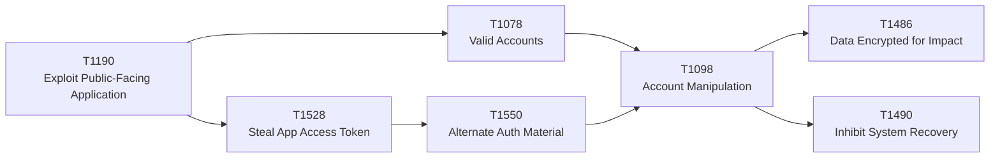

# MITRE ATT&CK crosswalk

This is a repository-authored crosswalk from the 2026 threat themes to representative ATT&CK Enterprise techniques.

It is not intended to imply that every publisher mapped its findings to these techniques.

## Core techniques

| 2026 theme | ATT&CK | Why it matters |
|---|---|---|
| Internet-facing exploitation | [T1190 Exploit Public-Facing Application](https://attack.mitre.org/techniques/T1190/) | Direct initial access through exposed applications, management surfaces, cloud/container workloads, and edge appliances. |
| Valid identity abuse | [T1078 Valid Accounts](https://attack.mitre.org/techniques/T1078/) | Stolen or abused credentials can provide initial access, persistence, privilege escalation, or defense evasion without malware. |
| OAuth/API token theft | [T1528 Steal Application Access Token](https://attack.mitre.org/techniques/T1528/) | Tokens can grant cloud, SaaS, container, and CI/CD access with the permissions of a user/service. |
| Session/token reuse | [T1550 Use Alternate Authentication Material](https://attack.mitre.org/techniques/T1550/) | Access tokens, hashes, Kerberos tickets, and web-session cookies can bypass normal login flows. |
| Privilege persistence | [T1098 Account Manipulation](https://attack.mitre.org/techniques/T1098/) | Includes additional cloud credentials, cloud roles, device registration, and other access-preserving changes. |
| Recovery denial | [T1490 Inhibit System Recovery](https://attack.mitre.org/techniques/T1490/) | Covers deletion/disablement of backups and recovery mechanisms across Windows, ESXi, network devices, and cloud environments. |
| Ransomware impact | [T1486 Data Encrypted for Impact](https://attack.mitre.org/techniques/T1486/) | Includes encryption of endpoints, ESXi virtual machines, and cloud storage objects. |

## 2026 attack-path mapping



## Detection implications

### T1190 — Exploit Public-Facing Application

Telemetry:

- reverse proxy / WAF;
- application errors;
- exposed service logs;
- post-exploit process activity;
- unexpected outbound connections;
- network appliance admin/config activity.

ATT&CK itself emphasizes exposed applications, network devices, cloud/container APIs, edge infrastructure, and segmentation/update controls.

### T1078 / T1550 — Valid or alternate authentication material

Telemetry:

- IdP sign-in.
- session/token issuance and use.
- cloud API caller identity.
- source IP/device/workload.
- privilege activation.
- SaaS audit.

Detection should ask whether the **context** is valid, not just whether the credential is valid.

### T1528 — Steal Application Access Token

Relevant environments include containers, IaaS, identity providers, office suites, and SaaS.

Detect:

- tokens used outside their normal source environment;
- unexpected API/resource use;
- unusual mailbox/file access by applications;
- CI/CD token use outside expected runners;
- refresh-token or grant changes.

### T1098 — Account Manipulation

High-value signals:

- additional cloud credentials.
- new cloud roles.
- device registration.
- privileged group changes.
- new authentication methods.
- new long-lived application credentials.

### T1490 / T1486 — Recovery and impact

Monitor:

- deletion of snapshots or recovery points;
- disabling versioning or backup policy;
- mass VM/datastore encryption;
- retention reduction;
- replication disablement;
- privileged recovery-plane actions.

MITRE's current T1490 guidance explicitly includes cloud snapshots/backups and ESXi snapshots, which aligns closely with the Recovery Plane model.

## From ATT&CK to architecture

ATT&CK describes adversary behavior. Architecture should reduce the number of reachable high-impact paths.

```text
Technique
→ required authority
→ reachable control plane
→ telemetry
→ preventive control
→ containment
→ recovery
```

That transformation is the purpose of this repository.