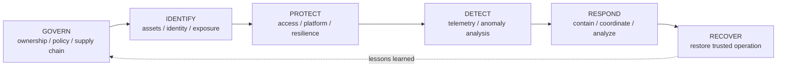

# NIST CSF 2.0 × CIS Controls v8.1 × 2026 Threat Crosswalk

This crosswalk connects the repository's 2026 threat themes to:

1. an **architecture requirement**;
2. a **NIST CSF 2.0 outcome area**;
3. representative **CIS Controls v8.1**;
4. implementation evidence that an enterprise can actually measure.

It is a repository-authored implementation aid. For authoritative NIST↔CIS mappings, use the NIST Informative References catalog and CIS Controls Navigator.

## Why combine them?

The frameworks answer different questions:

```text
Threat evidence
→ What is happening?

Architecture
→ What trust boundary / capability must change?

NIST CSF 2.0
→ What cybersecurity outcome should exist?

CIS Controls v8.1
→ What prioritized safeguards support that outcome?

Evidence / KPI
→ How do we know it is operating?
```

## Integrated crosswalk

| 2026 threat theme | Architecture requirement | NIST CSF 2.0 | Representative CIS Controls v8.1 | Operational evidence |
|---|---|---|---|---|
| Internet-facing exploitation | Complete external asset inventory + exploit-informed remediation | **ID.AM** Asset Management, **ID.RA** Risk Assessment, **PR.PS** Platform Security | **1** Enterprise Assets, **2** Software Assets, **7** Continuous Vulnerability Management | Internet-facing inventory coverage; KEV/EPSS-aware remediation age; unmanaged external assets |
| Identity / credential / session abuse | Federation, phishing-resistant auth, JIT privilege, token/session governance | **PR.AA** Identity Management / Authentication / Access Control | **5** Account Management, **6** Access Control Management | Standing privileged accounts; phishing-resistant coverage; stale identities; token/grant review age |
| Non-human identity / API / OAuth | Workload identity inventory, short-lived federation, owned integrations | **ID.AM**, **PR.AA**, **GV.RR** Roles/Responsibilities | **5**, **6**, **15** Service Provider Management, **16** Application Software Security | Long-lived keys; ownerless service principals; unreviewed OAuth grants; federated workload coverage |
| Cloud / SaaS control-plane abuse | Organization guardrails + attributable privileged actions | **GV.PO** Policy, **PR.PS**, **DE.CM** Continuous Monitoring | **4** Secure Configuration, **6**, **8** Audit Log Management, **12** Network Infrastructure Management | Guardrail exceptions; control-plane log coverage; privileged change attribution |
| Edge / hypervisor blind spots | Tier-0 treatment, segmented admin path, centralized audit | **ID.AM**, **PR.PS**, **DE.CM** | **1**, **4**, **8**, **12**, **13** Network Monitoring and Defense | Edge/hypervisor admin-log coverage; isolated admin paths; unsupported firmware exposure |
| SaaS / vendor trusted connectivity | Integration ownership, minimum delegated authority, emergency revoke | **GV.SC** Cybersecurity Supply Chain Risk Management, **PR.AA**, **RS.MA** Incident Management | **6**, **15**, **17** Incident Response Management | Owned integrations; tested revoke runbooks; supplier access review; inactive connector count |
| CI/CD / OSS supply chain | Provenance, signing, federated pipeline identity, dependency governance | **GV.SC**, **PR.PS**, **ID.RA** | **2**, **6**, **16**, **18** Penetration Testing | Signed release coverage; SBOM/provenance coverage; static CI/CD keys; dependency exception age |
| Ransomware / recovery denial | Separate Recovery Plane + immutable recovery + tested restore | **PR.IR** Technology Infrastructure Resilience, **RC.RP** Incident Recovery Plan Execution, **RC.CO** Recovery Communication | **11** Data Recovery, **17** Incident Response Management | Restore success rate; RTO validation; immutable copy coverage; recovery credential isolation |
| Machine-speed attacks | Detection-as-Code + bounded automated containment | **DE.AE** Adverse Event Analysis, **RS.AN** Incident Analysis, **RS.MA** Incident Management | **8**, **13**, **17**, **18** | MTTD/MTTC; automated reversible actions; detection validation frequency; false-positive burden |
| Long-dwell / non-EDR persistence | Long-retention cross-plane telemetry and hunt capability | **DE.CM**, **DE.AE**, **RS.AN** | **8**, **13**, **17** | Tier-0 retention period; source coverage; hunt cadence; investigation reconstruction success |
| AI agent / MCP authority | Agent identity, tool authorization, scope, approval, audit, revocation | **GV.PO**, **GV.RR**, **PR.AA**, **DE.CM**, **RS.MA** | **5**, **6**, **8**, **15**, **16**, **17** | Registered agents/connectors; broad scopes; human-gated destructive tools; tool-call logging coverage |

## How to use this in an architecture review

### Step 1 — Start from a real attack path

Example:

```text
Public exploit
→ service token
→ cloud role
→ backup administration
→ recovery deletion
```

### Step 2 — Identify the missing outcome

Examples:

- asset not known → **IDENTIFY** gap;
- excessive role → **PROTECT** gap;
- no cloud API telemetry → **DETECT** gap;
- no tested token-revocation process → **RESPOND** gap;
- production identity can delete backup → **RECOVER / architecture** gap;
- no owner for SaaS integration → **GOVERN** gap.

### Step 3 — Select representative CIS controls

Do not map by keyword alone. Pick controls that create the outcome.

For the example above:

- Control 1 — Enterprise Assets;
- Control 5 — Account Management;
- Control 6 — Access Control Management;
- Control 8 — Audit Log Management;
- Control 11 — Data Recovery;
- Control 17 — Incident Response Management.

### Step 4 — Require operating evidence

A policy document is not enough.

Useful evidence includes:

- inventory exports;
- access-review results;
- PIM/JIT activation logs;
- cloud organization-policy compliance;
- SIEM source-coverage reports;
- restore-test records;
- token-revocation exercise results;
- CI/CD attestation/signature evidence;
- agent/MCP tool-call audit.

## NIST CSF 2.0 function view



NIST explicitly treats the functions as concurrent outcomes rather than a one-time linear maturity path. The diagram above is an operational reading flow, not a claim that the CSF mandates a sequence.

## CIS Implementation Groups

CIS defines:

- **IG1** — essential cyber hygiene and the starting point for every enterprise;
- **IG2** — additional safeguards for organizations with greater complexity and sensitive data;
- **IG3** — the full safeguard set for higher-risk and more sophisticated environments.

Do not use an Implementation Group as a reason to ignore a critical architecture path.

A smaller organization may still need advanced safeguards around:

- privileged cloud administration;
- Internet-facing critical services;
- recovery infrastructure;
- CI/CD release authority;
- sensitive SaaS integrations;
- autonomous or privileged AI agents.

## Governance note

CIS Controls v8.1 realigned its NIST CSF mappings to CSF 2.0 and explicitly incorporated the new **Govern** function into its mapping model.

NIST's Informative References catalog includes **CIS Controls 8.1 to CSF 2.0**. NIST also notes that publication of a non-NIST informative reference does not constitute correctness validation or endorsement of the mapping.

For authoritative mapping work, use the published reference rather than treating this repository's crosswalk as compliance evidence.

## Primary references

- NIST CSF 2.0: https://www.nist.gov/cyberframework
- NIST CSF 2.0 Informative References: https://www.nist.gov/cyberframework/informative-references
- CIS Controls v8.1: https://www.cisecurity.org/controls/v8-1
- CIS Controls Navigator: https://www.cisecurity.org/controls/cis-controls-navigator
- CIS Implementation Groups: https://www.cisecurity.org/controls/implementation-groups
