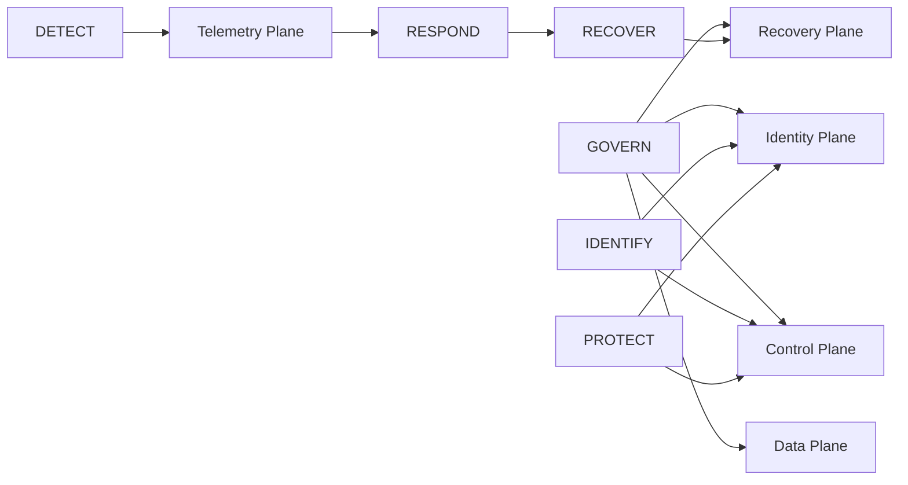

# NIST Cybersecurity Framework 2.0 crosswalk

NIST CSF 2.0 organizes cybersecurity outcomes into six functions:

**GOVERN, IDENTIFY, PROTECT, DETECT, RESPOND, RECOVER.**

NIST describes the functions as concurrent: GOVERN, IDENTIFY, PROTECT, and DETECT operate continuously, while RESPOND and RECOVER must remain ready for incidents.

Primary source: https://www.nist.gov/cyberframework

## 2026 theme crosswalk

| 2026 architecture theme | Primary CSF 2.0 functions | Practical outcome |
|---|---|---|
| Tier-0 and trust-boundary governance | GOVERN | Define ownership, risk tolerance, policy, roles, and supply-chain expectations. |
| Internet-facing / SaaS / identity inventory | IDENTIFY | Maintain asset, identity, dependency, and exposure knowledge. |
| Phishing-resistant MFA / JIT / segmentation | PROTECT | Restrict access and reduce blast radius before compromise. |
| Control-plane / token / agent telemetry | DETECT | Identify abnormal behavior across identity, cloud, SaaS, edge, recovery, and AI tools. |
| Machine-speed containment | RESPOND | Execute tested, bounded, reversible response actions and coordinate escalation. |
| Isolated recovery plane | RECOVER | Restore trusted operation after identity/control-plane compromise. |

## Why GOVERN matters in 2026

CSF 2.0 added **GOVERN** as a top-level function. That is especially relevant to:

- SaaS and vendor connectivity.
- Non-human identity ownership.
- AI-agent authorization.
- cloud organization guardrails.
- supply-chain risk.
- recovery ownership and testing.
- security telemetry requirements.

These are architecture and operating-model questions, not only technical control questions.

## Repository model to CSF

## Suggested use

Do not treat this crosswalk as a compliance checklist.

Use it to build a **target profile**:

1. Identify the high-impact 2026 attack paths relevant to the organization.
2. Define target outcomes across the six CSF functions.
3. Map existing controls and evidence.
4. Identify gaps in identity, control plane, telemetry, response, and recovery.
5. Prioritize gaps using business criticality and attack-path reachability.

## NIST / CIS relationship

NIST maintains an Informative References catalog, and as of 2026 it includes a mapping for **CIS Controls 8.1 to CSF 2.0**.

Reference:

- https://www.nist.gov/cyberframework/informative-references
- https://www.cisecurity.org/controls/v8-1

## Recommended architecture profile for this repository

### GOVERN

- Tier-0 ownership and policy.
- Service-provider / SaaS integration governance.
- AI-agent and connector governance.
- recovery-plane ownership.
- security architecture exception process.

### IDENTIFY

- human/non-human identity inventory.
- external attack-surface inventory.
- SaaS/OAuth relationship graph.
- cloud account/organization inventory.
- recovery dependencies.

### PROTECT

- federation and short-lived credentials.
- JIT privilege.
- phishing-resistant MFA.
- segmentation.
- immutable recovery.
- CI/CD provenance/signing.

### DETECT

- IdP/cloud/SaaS/edge/hypervisor/backup/AI telemetry.
- detection-as-code.
- control-plane change monitoring.

### RESPOND

- pre-authorized reversible containment.
- integration/token revocation.
- privileged-session termination.
- decision rights and incident communication.

### RECOVER

- isolated recovery identities.
- tested restore.
- IdP/hypervisor-loss scenario.
- trusted-state validation before reconnecting production.