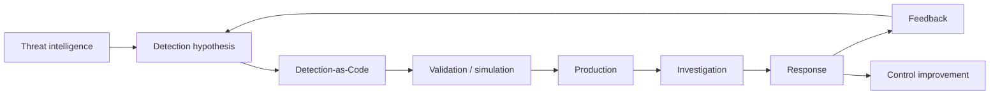

# Detection Engineering

The 2026 threat landscape creates two simultaneous problems:

- some intrusions progress at machine speed;
- others persist for months in infrastructure with weak telemetry.

Detection Engineering has to solve both.

## Operating loop



## Detection object

Every production detection should define:

- threat / technique;
- hypothesis;
- required data sources;
- query/rule;
- expected false-positive conditions;
- severity and confidence separately;
- response runbook;
- owner;
- test method;
- last validation date.

## Priority detection domains

### Identity

Examples:

- privileged role activated from abnormal context;
- MFA/reset followed by new session from new device/network;
- new OAuth grant with high-risk scope;
- token used outside expected workload;
- new cloud credential or privileged role.

ATT&CK anchors: T1078, T1528, T1550, T1098.

### Internet-facing and edge

Examples:

- exploit-like request followed by new process/egress;
- unexpected appliance admin login;
- configuration export/change;
- firmware/update outside maintenance;
- new local admin or authentication method.

ATT&CK anchor: T1190.

### Recovery

Examples:

- snapshot or recovery-point deletion;
- backup retention reduced;
- immutability disabled;
- replication disabled;
- mass restore/delete operations;
- recovery admin identity used outside exercise/incident.

ATT&CK anchors: T1490, T1486.

### Cloud / SaaS

Examples:

- new cross-account/tenant trust.
- public exposure change.
- logging disabled.
- service principal/OAuth scope expansion.
- bulk SaaS export.
- API activity from unexpected geography/workload.

### CI/CD

Examples:

- deploy role assumed by unexpected repository/branch.
- release-signing identity used outside pipeline.
- new runner or workflow with privileged cloud federation.
- secret access by unexpected job.
- package publish outside expected release window.

### AI / Agents / MCP

Examples:

- new tool/connector.
- scope expansion.
- token audience mismatch.
- destructive action without approval.
- agent accesses a new data classification.
- local MCP server spawns unexpected process.

## Bounded automation

Fast attacks justify automation, but automation should be risk-bounded.

Recommended sequence:

```text
Enrich
→ correlate
→ assign confidence
→ execute reversible containment
→ notify/investigate
→ require human approval for destructive or high-impact action
```

Examples of reversible containment:

- revoke a session/token;
- disable an OAuth grant;
- isolate an endpoint;
- temporarily block a source;
- remove a temporary role session;
- pause a CI/CD pipeline.

## Metrics

Avoid counting alerts as the primary KPI.

Better measures:

- mean time to high-confidence containment;
- percentage of Tier-0 actions covered by detections;
- detection validation freshness;
- percentage of detections with tested runbooks;
- time from CTI finding to deployed detection;
- false-positive cost per detection;
- percentage of high-confidence containment actions that are reversible/automated.

## Relationship to CTI

FIRST CTI 2026 strongly reinforces intelligence operationalization.

A useful maturity test is:

> Can a new adversary behavior move from intelligence → detection → validation → production → response without becoming a manual document handoff?

If not, the bottleneck is an operating-model problem, not an intelligence shortage.